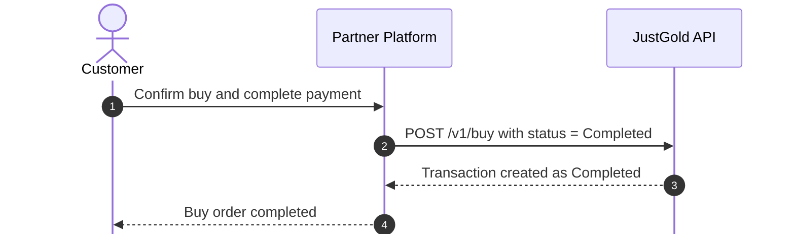
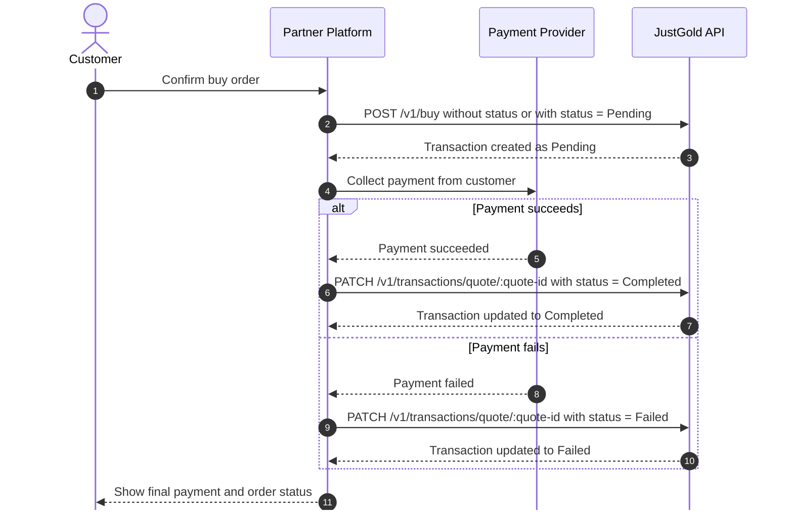

# Buy

Places a buy order using a previously generated quote.

## Endpoint

```http
POST /v1/buy
```

## Authentication

This endpoint requires:

- `X-Client-Id`
- `X-Timestamp`
- `X-Signature`

See [Authentication](../authentication.md) and [Request Signing](../request-signing.md).

## Request body

This endpoint uses the quote returned by the buy preview endpoint.

## Choosing the initial status

Partners should choose the initial `status` based on when they collect payment from the customer.

### Synchronous payment flow

Use this flow when customer payment is completed before creating the buy transaction.



### Asynchronous payment flow

Use this flow when the partner creates the buy transaction before the customer payment result is final.



| Field | Type | Required | Description |
| --- | --- | --- | --- |
| `quoteId` | string | Yes | Quote identifier returned by the preview endpoint. Must be a UUID. |
| `customerId` | string | Yes | Customer identifier. |
| `organizationCode` | string | No | Organization code to attribute the transaction to a specific organization. If omitted, the quote's root organization is used. |
| `status` | string | No | Initial transaction status. Must be `Pending` or `Completed`. If omitted, the transaction is created as `Pending`. |

## Sample request

```json
{
  "quoteId": "aa1c4362-7b9c-4f48-8a2b-4d4bc3e19412",
  "customerId": "6818744f3f1b2c7a9d5e4321",
  "status": "Completed"
}
```

## Response body

| Field | Type | Description |
| --- | --- | --- |
| `id` | string | Created transaction identifier. |

## Sample response

```json
{
  "id": "682710cc3f1b2c7a9d5e1111"
}
```

## Responses

| Status | Meaning |
| --- | --- |
| `201 Created` | Buy order placed successfully. |
| `400 Bad Request` | Request payload is invalid, `quoteId` is missing, or `customerId` is invalid. |
| `401 Unauthorized` | Organization context was not found for the authenticated partner. |
| `404 Not Found` | Customer or organization was not found. |
| `410 Gone` | Quote has expired. |
| `429 Too Many Requests` | Rate limit exceeded. Retry later. |
| `500 Internal Server Error` | An unexpected error occurred on the JustGold side. |
