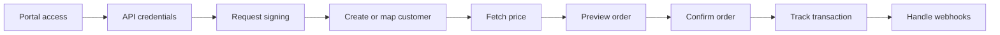

# API Integration

Use the API integration when you want full control of the customer experience and your backend can orchestrate JustGold operations directly.

## When to use APIs

Choose APIs if you need to:

- design your own buy, sell, delivery, and portfolio screens
- run all transaction logic through your backend
- keep payment, ledger, compliance, and notification systems tightly coupled
- customize retries, reconciliation, reporting, and observability
- support web, mobile, or branch-assisted experiences from one backend

## What your system does

Your platform is responsible for:

- authenticating your customer
- creating or mapping the customer in JustGold
- calling JustGold endpoints from your secure backend
- signing requests with your `client_secret`
- verifying signed responses
- presenting quotes and confirmations to the customer
- storing transaction IDs and partner references
- handling webhook updates

## API journey

## Build checklist

| Step | Guide |
| --- | --- |
| Get partner portal access | [Portal Access](../portal-access.md) |
| Configure credentials | [Authentication](../authentication.md) |
| Sign every request | [Request Signing](../request-signing.md) |
| Create or map customers | [Customers](customers.md) |
| Display live prices | [Prices](prices.md) |
| Generate quotes | [Preview](preview.md) |
| Place orders | [Buy](buy.md), [Sell](sell.md), [Delivery](delivery.md) |
| Reconcile orders | [Transactions](transactions.md), [Webhooks](../webhooks.md) |

## Endpoint map

| Area | Endpoints |
| --- | --- |
| Customers | `POST /v1/customers`, `GET /v1/customers`, `GET /v1/customers/:nationalId/holdings`, `GET /v1/customers/:nationalId/vault`, `GET /v1/customers/:nationalId/transactions` |
| Prices | `GET /v1/prices/latest` |
| Products | `GET /v1/products`, `GET /v1/products/:productId` |
| Preview | `POST /v1/buy/preview`, `POST /v1/sell/preview`, `POST /v1/delivery/preview` |
| Orders | `POST /v1/buy`, `POST /v1/sell`, `POST /v1/delivery` |
| Transactions | `PATCH /v1/transactions/:transactionId` |

## Next step

Continue with [Authentication](../authentication.md), then implement [Request Signing](../request-signing.md).
