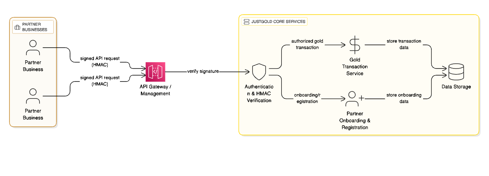

# HMAC Signature Authentication


> ℹ️ **Docs in Progress**  
> This section is still being worked on. Content may change.


> **Audience:** B2B partners integrating with JustGold APIs

> **Purpose:** Sign every request with an HMAC to ensure authenticity, integrity, and replay protection.


## Overview

All calls to JustGold’s B2B APIs **must be signed** using **HMAC-SHA256**. Partners obtain credentials in the **JustGold Partner Portal** and add these headers to each request:

* `X-Client-Id`: Your public access key (identifier)
* `X-Timestamp`: UNIX time in **seconds** (UTC). Must be within **±300s** of server time.
* `X-Signature`: Lowercase **hex** HMAC-SHA256 signature over a canonical string (spec below).





## Get your credentials

1. Sign in to the Partner Portal: **`portal.justgold.me`**
2. Go to **API Settings → Security**
3. Create/rotate an **Client Id** (public) and **Client Secret** (private)

   * Store the **Client Secret** securely (e.g., KMS/SSM/Secrets Manager).
   * **Never** embed in frontend/mobile apps.
   * Rotate periodically and on suspected exposure.

## Required request headers

| Header            | Required                 | Example                     | Notes                                                      |
| ----------------- | ------------------------ | --------------------------- | ---------------------------------------------------------- |
| `X-Client-Id`    | Yes                      | `jk_live_01H8…`             | Public identifier so the server can look up your secret.   |
| `X-Timestamp`     | Yes                      | `1735550100`                | UNIX epoch **seconds**, UTC. Must be within **±300s**.     |
| `X-Signature`     | Yes                      | `e462fd8f…`                 | Lowercase 
| `Content-Type`    | As applicable            | `application/json`          | Use UTF‑8.                                                 |

---

## Canonical request & string-to-sign

### 1) Canonical body hash

Compute `content_sha256` as lowercase hex **SHA-256 of the exact request body bytes**:

* For JSON, hash the **raw bytes you transmit** (no re-serialization during signing!).
* If there is **no body** (e.g., GET), hash the empty string (`""`).
* `SHA256("")` is `e3b0c44298fc1c149afbf4c8996fb92427ae41e4649b934ca495991b7852b855`.

### 2) Canonical query string

* Start from the query parameters as sent by the client.
* **Percent-encode** per RFC 3986 (space as `%20`, not `+`).
* Sort by **key**, then by **value**, both lexicographically.
* Join as `key=value` pairs with `&`. Use an empty string if no query.

### 3) String-to-sign

Build the string below using **exact newlines** (`\n`) with **no trailing spaces**:

```
JG-HMAC-SHA256
{timestamp}
{method}
{path}
{canonical_query_string}
{content_sha256}
```

Where:

* `timestamp` = the value you send in `X-Timestamp` (UNIX seconds)
* `method` = uppercase HTTP method (e.g., `POST`)
* `path` = the request path only (e.g., `/v1/orders`), **no scheme, host, or fragment**
* `canonical_query_string` = as defined above (or empty string if none)
* `content_sha256` = lowercase hex SHA-256 of the **raw** body bytes

### 4) Signature

```
signature = hex( HMAC_SHA256(secret, string_to_sign) )  // lowercase hex
```

Send this as `X-Signature`.

---

## End-to-end example (JSON POST)

**Inputs**

* Secret: `s3cr3t_test_key_justgold`
* Client Id: `jk_live_example`
* Method: `POST`
* Path: `/v1/transactions/buy`
* Query: *(none)*
* Body (minified JSON, UTF‑8):

```json
{"amount":"5000","transactionId":"12345"}
```

**Step A — Body hash**

```
content_sha256 = faaa1f00ee99cf6afdc2ee9ded75dcdeee2870f06e5ee23b9a886d73e1c6dfe8
```

**Step B — Timestamp**

```
X-Timestamp = 1735550100
```

**Step C — String-to-sign**

```
JG-HMAC-SHA256
1735550100
POST
/v1/transaction/buy

faaa1f00ee99cf6afdc2ee9ded75dcdeee2870f06e5ee23b9a886d73e1c6dfe8
```

**Step D — Signature (hex)**

```
X-Signature = e462fd8fae45c69a8eb9f73dcddeb949962ae89a5d6ff66ca33461a8e119ec89
```

**Final request**

```http
POST /v1/transactions/buy HTTP/1.1
Host: api.justgold.me
Content-Type: application/json; charset=utf-8
X-Access-Key: jk_live_example
X-Timestamp: 1735550100
X-Signature: e462fd8fae45c69a8eb9f73dcddeb949962ae89a5d6ff66ca33461a8e119ec89

{"amount":"5000","transactionId":"12345"}
```

## Example (GET with query)

Query sent by client: `?z=two&z=three&version=1&a=hello`

**Canonical query**

```
a=hello&version=1&z=three&z=two
```

**Body hash** (empty body)

```
e3b0c44298fc1c149afbf4c8996fb92427ae41e4649b934ca495991b7852b855
```

**String-to-sign**

```
JG-HMAC-SHA256
1735550160
GET
/v1/ping
 a=hello&version=1&z=three&z=two
 e3b0c44298fc1c149afbf4c8996fb92427ae41e4649b934ca495991b7852b855
```

**Signature**

```
fa86029249a12a9531e269ef8986cba153a9839d741f6f38e457c6eb96bede76
```

> ⚠️ Make sure the **exact same canonicalization** is used on client and server, including percent-encoding and sort rules.

---

## Client snippets

### Node.js

```ts
import crypto from 'crypto'
import { URLSearchParams } from 'url'

/** RFC3986 percent-encoding and canonical sort */
function canonicalQuery(params: Record<string, string | string[] | undefined>): string {
  const pairs: [string, string][] = []
  for (const [k, v] of Object.entries(params)) {
    if (v === undefined) continue
    if (Array.isArray(v)) v.forEach(val => pairs.push([k, val]))
    else pairs.push([k, v])
  }
  pairs.sort((a, b) => (a[0] === b[0] ? a[1].localeCompare(b[1]) : a[0].localeCompare(b[0])))
  const enc = (s: string) => encodeURIComponent(s).replace(/%20/g, '%20').replace(/[!'()*]/g, c => '%' + c.charCodeAt(0).toString(16).toUpperCase())
  return pairs.map(([k, v]) => `${enc(k)}=${enc(v)}`).join('&')
}

function sha256Hex(bytes: Buffer | string) {
  return crypto.createHash('sha256').update(bytes).digest('hex')
}

export function sign({
  method,
  path,
  query,          // object map, already what you intend to send
  bodyBytes,      // Buffer of the exact bytes you will transmit
  timestamp,      // seconds
  secret,
}: {
  method: string
  path: string
  query?: Record<string, string | string[]>
  bodyBytes?: Buffer
  timestamp: number
  secret: string
}) {
  const canonicalQuery = query ? canonicalQuery(query) : ''
  const contentSha256 = sha256Hex(bodyBytes ?? Buffer.from(''))
  const stringToSign = [
    'JG-HMAC-SHA256',
    String(timestamp),
    method.toUpperCase(),
    path,
    canonicalQuery,
    contentSha256,
  ].join('\n')
  const signature = crypto.createHmac('sha256', Buffer.from(secret, 'utf8')).update(stringToSign).digest('hex')
  return { signature, contentSha256, canonicalQuery, stringToSign }
}
```

**Express verification (reads raw body):**

```ts
import express from 'express'
import crypto from 'crypto'

const app = express()
// Capture raw body before JSON parse
app.use(express.json({ verify: (req: any, _res, buf) => { req.rawBody = Buffer.from(buf) } }))

function verifySignature(req: any, secret: string) {
  const timestamp = String(req.header('X-Timestamp') || '')
  const accessKey = req.header('X-Access-Key')
  const signature = String(req.header('X-Signature') || '')
  if (!timestamp || !accessKey || !signature) return false

  const now = Math.floor(Date.now() / 1000)
  if (Math.abs(now - Number(timestamp)) > 300) return false // clock skew

  const url = new URL(req.protocol + '://' + req.get('host') + req.originalUrl)
  // Build canonical query
  const params: Record<string, string | string[]> = {}
  url.searchParams.forEach((value, key) => {
    const existing = params[key]
    if (existing === undefined) params[key] = value
    else params[key] = ([] as string[]).concat(existing as any, value)
  })
  const canonicalQuery = [...url.searchParams.entries()].sort((a,b)=>a[0]===b[0]?a[1].localeCompare(b[1]):a[0].localeCompare(b[0]))
    .map(([k,v])=> encodeURIComponent(k).replace(/%20/g,'%20').replace(/[!'()*]/g, c=> '%' + c.charCodeAt(0).toString(16).toUpperCase()) + '=' +
                  encodeURIComponent(v).replace(/%20/g,'%20').replace(/[!'()*]/g, c=> '%' + c.charCodeAt(0).toString(16).toUpperCase()))
    .join('&')

  const contentSha256 = crypto.createHash('sha256').update(req.rawBody ?? Buffer.alloc(0)).digest('hex')

  const stringToSign = [
    'JG-HMAC-SHA256',
    timestamp,
    req.method.toUpperCase(),
    url.pathname,
    canonicalQuery,
    contentSha256,
  ].join('\n')

  const expected = crypto.createHmac('sha256', Buffer.from(secret, 'utf8')).update(stringToSign).digest('hex')
  return crypto.timingSafeEqual(Buffer.from(signature, 'hex'), Buffer.from(expected, 'hex'))
}

app.post('/v1/orders', (req, res) => {
  const secret = lookupSecretByAccessKey(req.header('X-Access-Key')!) // implement securely
  if (!secret || !verifySignature(req, secret)) {
    return res.status(401).json({ error: 'invalid_signature' })
  }
  res.json({ ok: true })
})
```

### cURL (quick test)

```bash
# Example values
ACCESS_KEY="jk_live_example"
SECRET="s3cr3t_test_key_justgold"
TS=$(date +%s)
BODY='{"amount":"5000","transactionId":"12345"}'
CONTENT_SHA256=$(printf %s "$BODY" | openssl dgst -sha256 -binary | xxd -p -c 256)
STRING_TO_SIGN=$(printf "JG-HMAC-SHA256\n%s\nPOST\n/v1/orders\n\n%s" "$TS" "$CONTENT_SHA256")
SIG=$(printf %s "$STRING_TO_SIGN" | openssl dgst -sha256 -hmac "$SECRET" -hex | awk '{print $2}')

curl -X POST "https://api.justgold.me/v1/transactions/buy" \
  -H "Content-Type: application/json" \
  -H "X-Client-Id: $CLIENT_ID" \
  -H "X-Timestamp: $TS" \
  -H "X-Signature: $SIG" \
  -d "$BODY"
```

---

## Server verification checklist

* [ ] Lookup **secret** by `X-Access-Key`.
* [ ] Validate `X-Timestamp` is within **±300s**.
* [ ] Recompute canonical query and **body hash using raw bytes**.
* [ ] Rebuild string-to-sign and compute expected signature.
* [ ] Use **constant-time** comparison (e.g., `timingSafeEqual`).

---

## Error responses

```json
{
  "status":401,
  "error": "invalid_signature",
  "message": "Signature mismatch",
  "requestId": "a1b2c3d4",
  "timestamp": 1735550105
}
```

**Common error codes**

* `invalid_signature` — signature does not match
* `timestamp_out_of_range` — timestamp older/newer than allowed window
* `client_id` — unknown or revoked access key
* `unsupported_content_type` — content type not allowed for endpoint

---

## Security & operational best practices

* **Time sync:** run NTP/Chrony; reject requests with skew > **5 min**.
* **Rotate** keys periodically; maintain overlapped validity during rollouts.
* **Store secrets** only in secure vaults (KMS/SSM/HashiCorp Vault), not in code or git.
* **Least privilege:** scope keys to specific environments (sandbox vs prod).
* **Logging:** log `X-Client-Id`, request path, and result — **never log secrets or full signatures**.
* **Rate limits:** respect published limits; exponential backoff on 429/5xx.

---

## Sandbox & health check

* **Sandbox base URL:** `https://api.sandbox.justgold.me`
* **Health:** `GET /v1/health` (unsigned) and `GET /v1/health/secure` (signed)

```http
GET /v1/health/secure HTTP/1.1
X-Access-Key: jk_live_example
X-Timestamp: 1735550160
X-Signature: fa86029249a12a9531e269ef8986cba153a9839d741f6f38e457c6eb96bede76
```

---

## Troubleshooting

* **Signature mismatch?** Ensure both sides use identical **canonicalization** (query encoding, sorting) and the **exact raw body bytes** that were transmitted.
* **Clock skew?** Check server/client time sources (NTP). Try again and verify your `X-Timestamp`.
* **Proxy mutation?** Confirm that gateways/CDNs do not **rewrite the body** or query string.
* **Hex vs base64?** We use **lowercase hex** everywhere.
