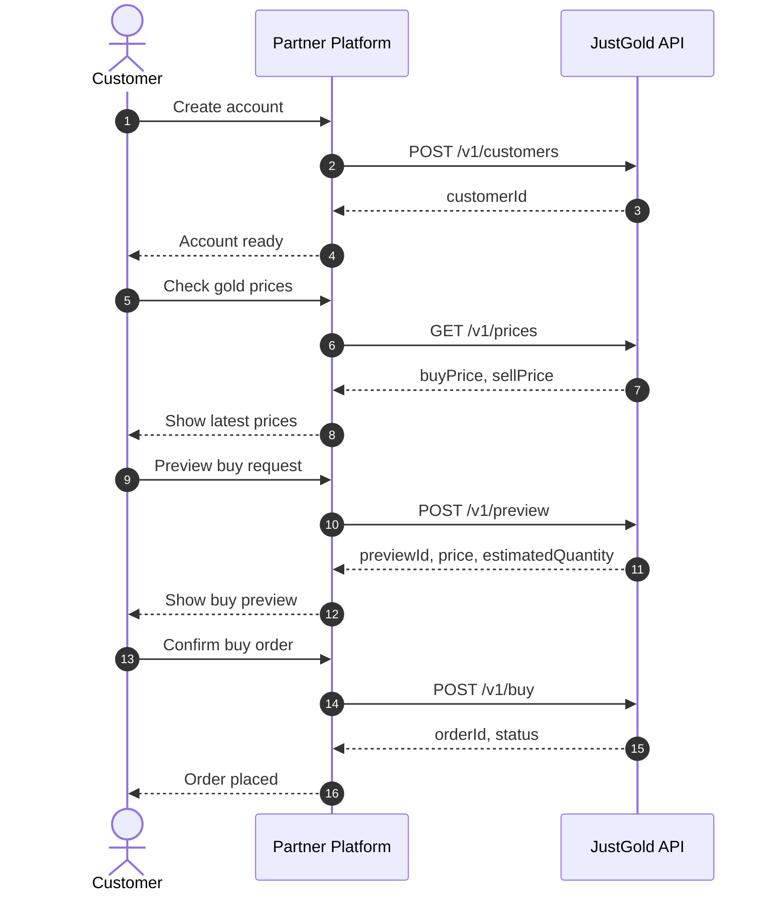
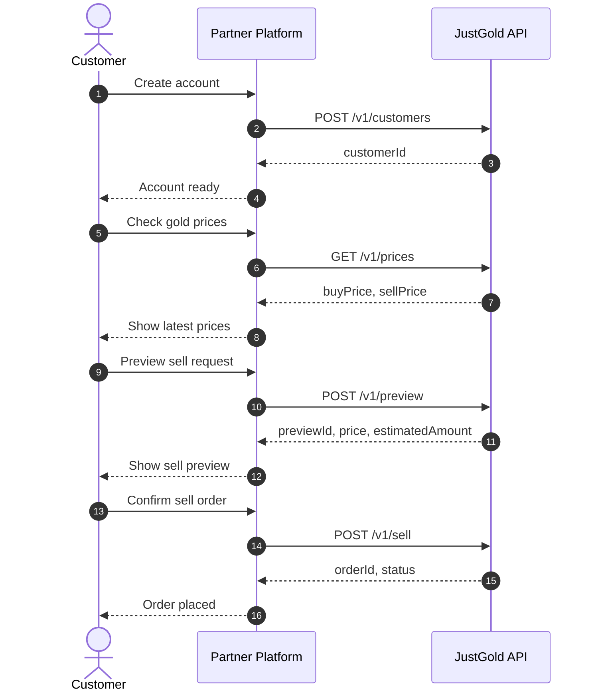

# Integration Flow

This is the recommended partner integration sequence.

## Buy flow



## Sell flow



## 1. Create or map your customer

Use `POST /v1/customers` to register the customer in JustGold or link your internal customer record to a JustGold customer ID.

## 2. Fetch the latest prices

Use `GET /v1/prices` to display the current buy and sell prices before asking the customer to confirm a transaction.

## 3. Preview the order

Use `POST /v1/preview` to calculate the expected quantity, amount, fees, and totals before placing a final order.

## 4. Place the order

Call:

- `POST /v1/buy` for a buy order
- `POST /v1/sell` for a sell order

Use the preview response to keep the confirmed order aligned with the quoted values.

## 5. Store identifiers

Persist the following identifiers in your system:

- JustGold customer ID
- Preview ID, if returned
- Buy or sell order ID
- Your own internal transaction reference

## Recommended backend flow

```text
Create customer -> Get prices -> Preview -> Buy or Sell -> Store IDs and status
```
