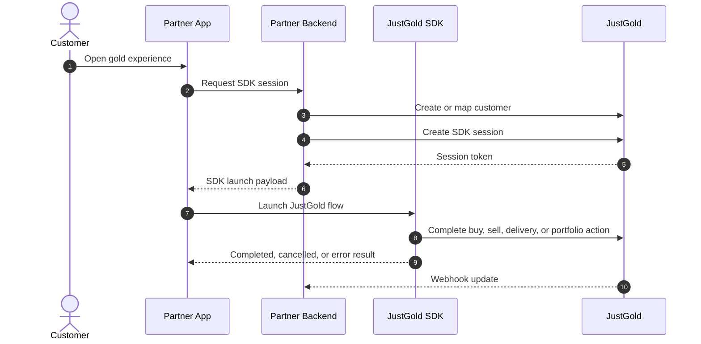
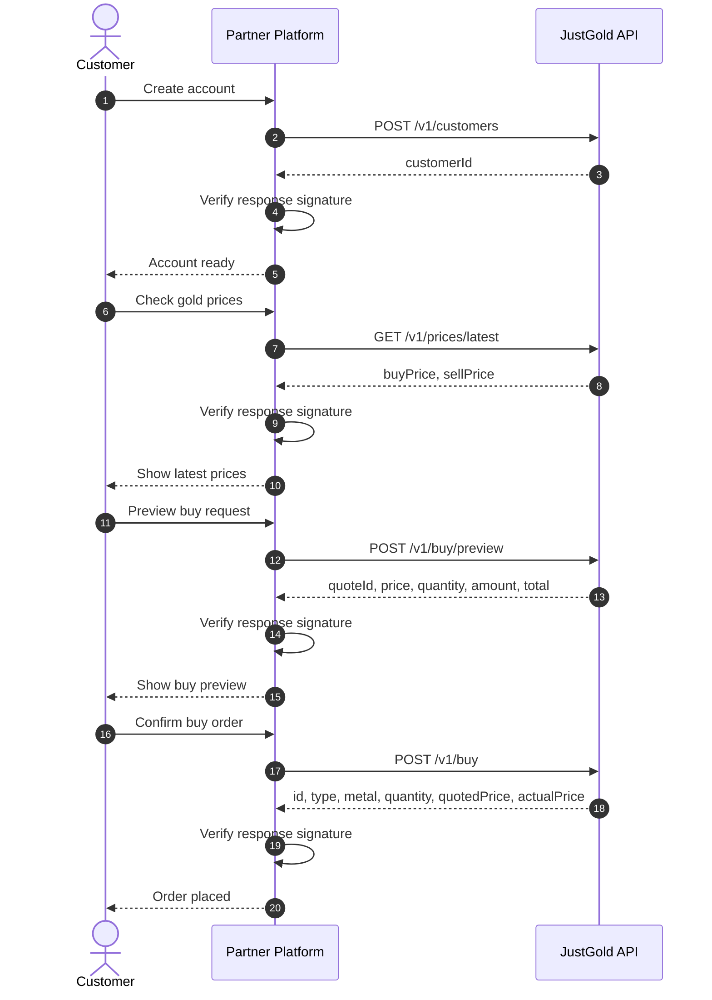
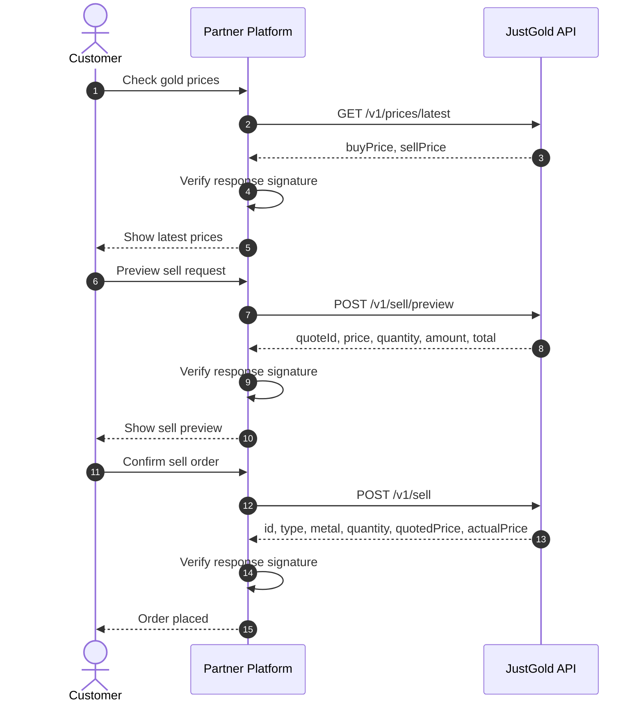

# Integration Flow

This page shows the recommended JustGold flow for each integration method.

## Pick the right flow

| Method | Flow |
| --- | --- |
| [API integration](api/overview.md) | Your backend calls JustGold APIs directly and your product owns the customer screens |
| [SDK integration](sdk/overview.md) | Your app launches the JustGold SDK using a short-lived session from your backend |

## SDK flow

For platform-specific setup, see [React Native SDK Integration](sdk/react-native.md) or [Flutter SDK Integration](sdk/flutter.md).

## Buy flow

## Sell flow

## 1. Create or map your customer

Use `POST /v1/customers` to register the customer in JustGold or link your internal customer record to a JustGold customer ID.

## 2. Fetch the latest prices

Use `GET /v1/prices/latest` to display the current buy and sell prices before asking the customer to confirm a transaction.

## 3. Preview the order

Use:

- `POST /v1/buy/preview` for buy quotes
- `POST /v1/sell/preview` for sell quotes

to generate a quote before placing a final order.

## 4. Place the order

Call:

- `POST /v1/buy` for a buy order
- `POST /v1/sell` for a sell order

Use the preview response to keep the confirmed order aligned with the quoted values.

## 5. Store identifiers

Persist the following identifiers in your system:

- JustGold customer ID
- Quote ID
- Buy or sell transaction ID
- Your own internal transaction reference

## 6. Verify signed responses

Before using any JustGold response, verify the response signature using the shared `client_secret`.
