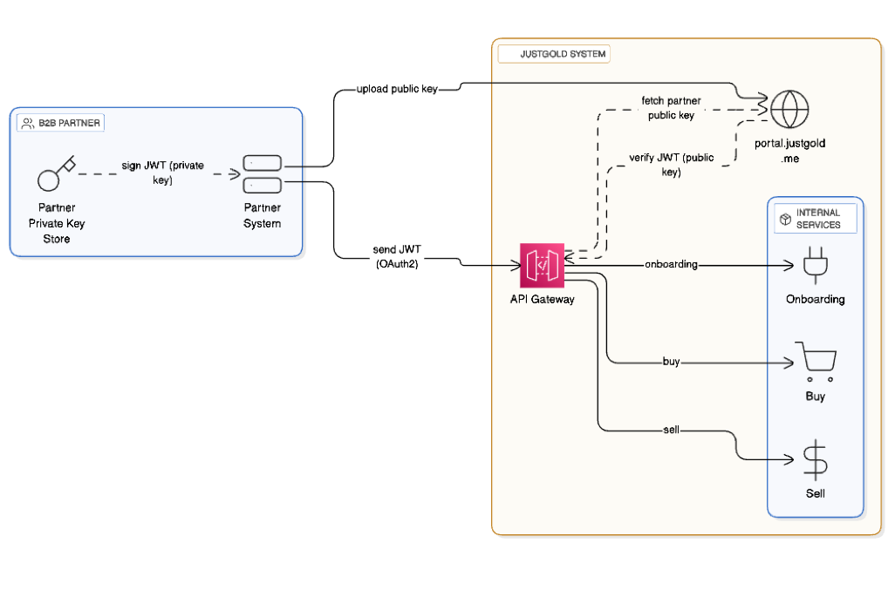

# OAuth2 JWT Authentication


> ℹ️ **Docs in Progress**  
> This section is still being worked on. Content may change.

> **Audience:** B2B partners integrating with JustGold APIs

> **Purpose:** Secure authentication via OAuth2 JWTs signed with your private key and verified by JustGold using your uploaded public key.


### Overview

JustGold supports OAuth2-style JWT authentication.
- Partners generate JWT access tokens signed with their private key.
- JustGold verifies the signature using the partner’s uploaded public key from portal.justgold.me.
- This ensures that only requests issued by you are accepted.




### Setup
1.	Generate an asymmetric key pair (RSA 2048 or 4096, or EC P-256).

###### RSA 2048 example
``` 
	openssl genrsa -out private.pem 2048
    openssl rsa -in private.pem -pubout -out public.pem
```

2.	Upload the public key in the Partner Portal:
	- Log in to `portal.justgold.me`.
	- Go to API Settings → Security → JWT Keys.
	- Upload your `public.pem`.

3.	Store your private key securely. Use it only in your backend to issue JWTs. Never share with anyone, not even on justgold's portal.


### Request Flow
1.	Your backend signs a JWT access token with your private key.
2.	Attach the token in the Authorization header when calling JustGold APIs:

``` Authorization: Bearer <jwt_token> ```

3.	JustGold retrieves your public key (from portal) and verifies the JWT.
4.	If valid, the request is authenticated and processed.


### JWT Structure

Header
```
{
  "alg": "RS256",
  "typ": "JWT"
}
```

Payload (claims)

``` 
{
  "iss": "your-client-id",
  "sub": "user-123",
  "aud": "justgold-api",
  "iat": 1735550100,
  "exp": 1735553700,
  "scope": "create:transaction read:transactions"
}
```

### Signature

The token is signed with your private key (RS256/ES256).


###### Sample Token

``` eyJhbGciOiJSUzI1NiIsInR5cCI6IkpXVCJ9.eyJpc3MiOiJwYXJ0bmVyLTEyMyIsInN1YiI6InVzZXItMTIzIiwiYXVkIjoianVzdGdvbGQtYXBpIiwiaWF0IjoxNzM1NTUwMTAwLCJleHAiOjE3MzU1NTM3MDAsImp0aSI6IjQ2YzZiZjVkLTJlYzctNGE5Yi05YjFhLTVhYjJlNzdlZDY3NyJ9.Dr3Pjz... ```


### Sample Client Code (Node.js)

```
import fs from "fs";
import jwt from "jsonwebtoken";

const privateKey = fs.readFileSync("./private.pem");

const token = jwt.sign(
  {
    iss: "client-id-123",
    sub: "user-123",
    aud: "justgold-api",
    iat: Math.floor(Date.now() / 1000),
    exp: Math.floor(Date.now() / 1000) + 3600,
    scope: "create:transaction read:transactions"
  },
  privateKey,
  { algorithm: "RS256" }
);

console.log("JWT:", token);
```

### Server Verification (JustGold)

On the JustGold side:
1.	Extract Authorization: Bearer <token>
2.	Decode JWT header & payload.
3.	Retrieve partner’s uploaded public key.
4.	Verify:
	- Signature with public key.
	- iss matches Client ID.
	- aud = “justgold-api”.
	- exp not expired.
	- scope

### Error Responses

{
  "status": 401,
  "error": "invalid_token",
  "message": "Token expired or signature invalid",
  "timestamp": 1735550123
}

### Common error codes
	•	invalid_signature — signature verification failed
	•	expired_token — exp claim passed
	•	invalid_issuer — iss mismatch
	•	invalid_audience — aud mismatch


### Best Practices
	•	Use short-lived tokens (≤1 hour).
	•	Refresh tokens securely on the server side.
	•	Rotate key pairs regularly; upload new public keys to the portal.
	•	Protect the private key with KMS, Vault, or equivalent.
	•	Validate tokens server-side only — never on frontend.

### Sandbox & Health
	- Sandbox URL: https://api.sandbox.justgold.me
	- Health check (public): https://api.sandbox.justgold.me/v1/health
	- Secured Health check (private): https://api.sandbox.justgold.me/v1/health/secure


``` 
GET /v1/health/secure
Authorization: Bearer <jwt>
```
