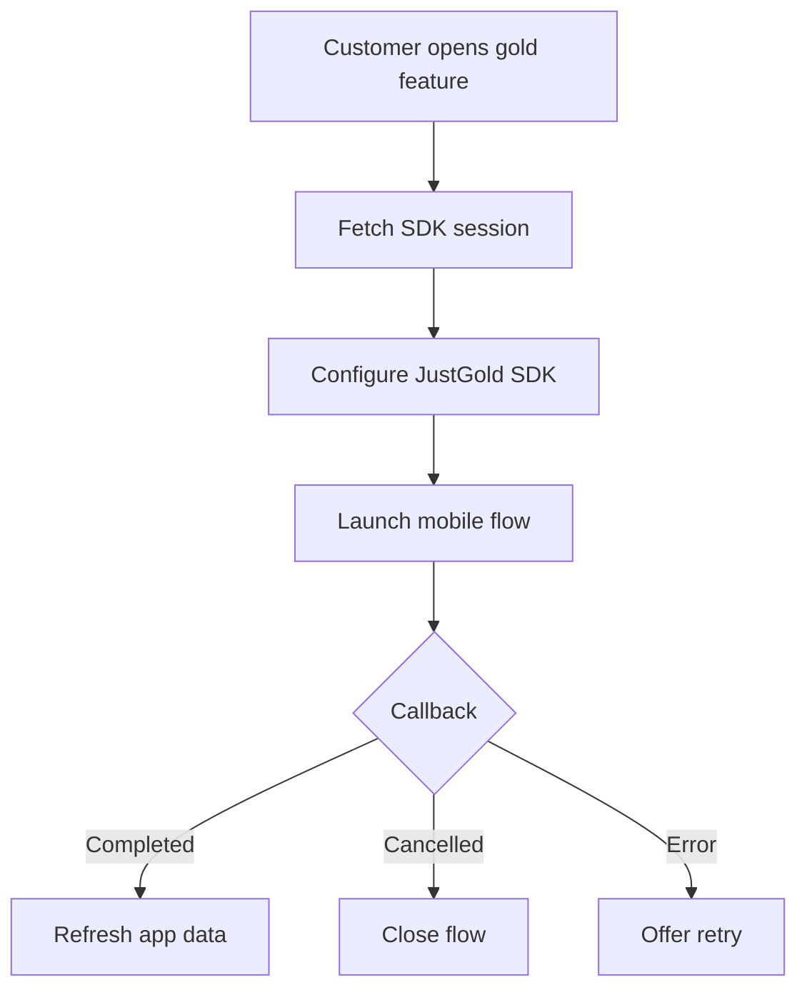

# Flutter SDK Integration

Use this guide to add the JustGold SDK to a Flutter app.

## Integration shape



## 1. Add the package

Use the SDK package and version provided during onboarding.

```yaml
dependencies:
  justgold_flutter_sdk: ^1.0.0
```

Then fetch dependencies.

```bash
flutter pub get
```

## 2. Create a backend session endpoint

Your Flutter app should not store partner secrets. Keep `client_id` and `client_secret` on your backend, then return a short-lived SDK launch payload to the app.

Example app-facing response:

```json
{
  "environment": "sandbox",
  "sessionToken": "sdk_session_token",
  "customerRef": "partner_customer_reference"
}
```

## 3. Initialize the SDK

```dart
import 'package:justgold_flutter_sdk/justgold_flutter_sdk.dart';

final justGold = JustGold(
  environment: JustGoldEnvironment.sandbox,
);
```

## 4. Launch the flow

```dart
Future<void> openGoldExperience() async {
  final session = await fetchJustGoldSession();

  final result = await justGold.launch(
    sessionToken: session.sessionToken,
    customerRef: session.customerRef,
  );

  if (result.status == JustGoldResultStatus.completed) {
    // Refresh holdings, transactions, or dashboard state.
  }
}
```

## 5. Handle results

| Result | Recommended app behavior |
| --- | --- |
| `completed` | Refresh holdings, wallet state, or transaction history |
| `cancelled` | Close the SDK flow and keep the user in the gold area |
| `error` | Show a retry action and record the SDK error code |

## 6. Handle SDK events

The SDK can emit events to the host app during a flow.

| Event | When it fires | Host app action |
| --- | --- | --- |
| `sessionExpired` | The short-lived SDK session is no longer valid. | Request a new SDK session from your backend and reinitialize the SDK. |
| `paymentRequested` | The customer confirms a buy or delivery quote and payment must be completed outside the SDK. | Start the Flutter payment flow, then return the customer to the SDK status screen after payment is processed. |

## 7. Production checklist

- Switch from sandbox to production environment values
- Confirm Android package ID and iOS bundle ID
- Verify platform permissions and native build settings
- Test completed, cancelled, and error states
- Confirm backend webhook handling
- Reconcile SDK flow results against transaction records

## Related docs

- [SDK Overview](sdk/overview.md)
- [Portal Access](../portal-access.md)
- [Webhooks](../webhooks.md)
