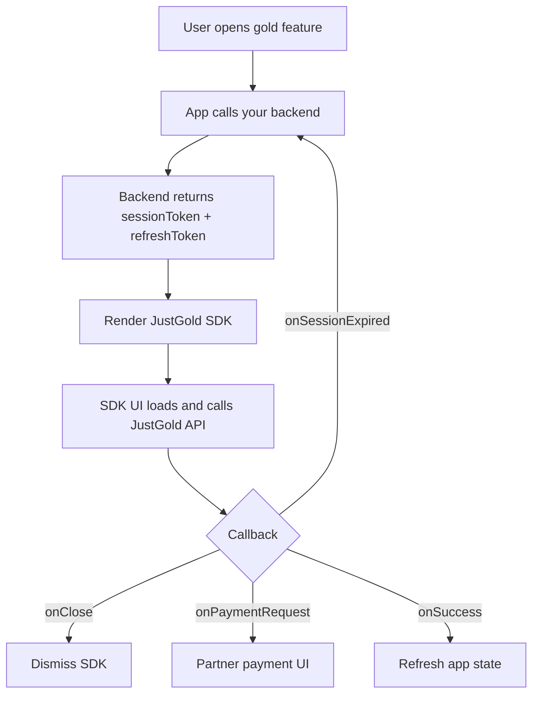

# Flutter SDK Integration

Embed the JustGold gold & silver trading UI in your Flutter app with **`justgold_sdk`** on [pub.dev](https://pub.dev/packages/justgold_sdk). The UI ships as a pre-built bundle inside the package — no CDN or separate UI deploy.

> **Prerequisites:** [Session Token](sdk/session-token.md) from your backend · [SDK Overview](sdk/overview.md)

## Integration shape


```mermaid
flowchart TD
    A[User opens gold feature] --> B[App calls your backend]
    B --> C[Backend returns sessionToken + refreshToken]
    C --> D[Render JustGold SDK]
    D --> E[SDK UI loads and calls JustGold API]
    E --> F{Callback}
    F -->|onClose| G[Dismiss SDK]
    F -->|onPaymentRequest| H[Partner payment UI]
    F -->|onSuccess| I[Refresh app state]
    F -->|onSessionExpired| B
```

Your backend still owns HMAC credentials and customer mapping. The mobile app receives only short-lived JWTs — see [Session Token](sdk/session-token.md).

---

## 1. Add the package

```yaml
dependencies:
  justgold_sdk: ^1.0.0
```

```bash
flutter pub get
```

---

## 2. Fetch a session from your backend

Do **not** put `client_secret` in the mobile app. Call **your** backend, which signs `POST /v1/customers/{customerIdentifier}/token` with HMAC and returns:

```json
{
  "sessionToken": "eyJhbGciOiJIUzI1NiIsInR5cCI6IkpXVCJ9...",
  "refreshToken": "g1ZmVyZXNoX3Rva2VuX2V4YW1wbGU..."
}
```

See [Session Token](sdk/session-token.md) and [Request Signing](../api/request-signing.md).

> **Development only:** The package includes optional `PartnerApiClient` helpers for local testing. **Never ship `clientSecret` in production app builds.**

---

## 3. Embed the SDK

```dart
import 'package:flutter/material.dart';
import 'package:justgold_sdk/justgold_sdk.dart';

class TradingPage extends StatelessWidget {
  const TradingPage({
    super.key,
    required this.token,
    required this.refreshToken,
    this.sandbox = false,
  });

  final String token;
  final String refreshToken;
  final bool sandbox;

  @override
  Widget build(BuildContext context) {
    return Scaffold(
      body: SafeArea(
        child: JustGoldWebView(
          token: token,
          refreshToken: refreshToken,
          sandbox: sandbox,
          locale: 'en',
          theme: const SdkTheme(
            mode: SdkThemeMode.light,
            primaryColor: '#2563eb',
          ),
          onClose: () => Navigator.of(context).pop(),
          onSessionExpired: () => refreshSessionFromBackend(),
          onSuccess: (payload) => debugPrint('Transaction: $payload'),
          onPaymentRequest: (payload, _) {
            Navigator.of(context).push(
              MaterialPageRoute(
                builder: (_) => PartnerPaymentPage(payload: payload),
              ),
            );
          },
          onError: (error) => debugPrint('SDK error: $error'),
        ),
      ),
    );
  }
}
```

| Parameter | Notes |
| --- | --- |
| `sandbox` | `true` → sandbox API; omit or `false` → production |
| `locale` | `'en'` or `'ar'` |
| `theme` | Light/dark mode, brand colors, optional partner branding |
| `refreshToken` | Enables automatic silent renewal ~60s before JWT expiry |

Partners do **not** pass `apiBaseUrl` — the wrapper resolves it from the `sandbox` flag.

---

## 4. Widget parameters

| Parameter | Type | Description |
| --- | --- | --- |
| `token` | `String` | **Required.** Session JWT from your backend |
| `refreshToken` | `String?` | Optional refresh token for silent renewal |
| `sandbox` | `bool` | Sandbox vs production API (default `false`) |
| `locale` | `String?` | `'en'` or `'ar'` |
| `theme` | `SdkTheme?` | Mode, colors, partner branding |
| `platformFee` | `double?` | Optional flat platform fee for preview APIs |
| `logLevel` | `String?` | `debug` \| `info` \| `warn` \| `error` |
| `onClose` | `VoidCallback?` | User closed the SDK |
| `onSessionExpired` | `VoidCallback?` | Token expired — fetch a new session |
| `onSuccess` | `TransactionCallback?` | Buy/sell transaction complete |
| `onPaymentRequest` | `PaymentRequiredCallback?` | Open partner payment UI — see below |
| `onError` | `ErrorCallback?` | Unrecoverable SDK error |
| `onLog` | `LogCallback?` | Optional structured SDK logs |
| `onResolvePlatformFee` | `Future<double> Function(dynamic)?` | Async callback — return a dynamic platform fee instead of `platformFee` |
| `onAuthRequired` | `VoidCallback?` | Auth failed — re-issue session |
| `onSdkEvent` | `SdkEventCallback?` | Raw bridge events for advanced integrations |

### Theming

```dart
const SdkTheme(
  mode: SdkThemeMode.light,
  primaryColor: '#2563eb',
  branding: PartnerBranding(
    partnerName: 'Your Bank',
    logoUrl: 'https://cdn.example.com/logo.png',
    walletName: 'Your Wallet',
  ),
)
```

Logo URLs must be **HTTPS**.

---

## 5. Handle SDK callbacks

| Callback | When | Your action |
| --- | --- | --- |
| `onClose` | User taps close | `Navigator.pop` or dismiss |
| `onSessionExpired` | JWT expired and renew failed | Call your backend for a new token pair |
| `onSuccess` | Buy/sell confirmed | Refresh holdings or transaction history |
| `onPaymentRequest` | User confirmed quote; payment is partner-side | Open payment UI → PATCH transaction status |
| `onResolvePlatformFee` | SDK needs to resolve the platform fee dynamically | Return a `Future<double>` with the fee amount |
| `onAuthRequired` | Authentication failed or session cannot be renewed | Re-issue a fresh session from your backend |
| `onError` | SDK error | Log and show a recoverable message |

---

## 6. Full-page payment

When the user confirms a buy, sell, or delivery quote, the SDK creates a **Pending** transaction and emits **`PAYMENT_REQUIRED`**. Your app collects payment using your PCI-compliant stack, then updates status via the partner HMAC API:

```http
PATCH /v1/transactions/:transactionId
```

See [Transactions](../api/transactions.md).

### Pattern A — Overlay (recommended)

Keep `JustGoldWebView` **mounted**. Push a full-screen payment route on top:

```dart
onPaymentRequest: (payload, _) {
  Navigator.of(context).push(
    MaterialPageRoute(builder: (_) => PartnerPaymentPage(payload: payload)),
  );
},
// 1. Collect payment (your PSP / wallet)
// 2. PATCH /v1/transactions/:id from your backend (HMAC)
// 3. Navigator.pop — SDK polls and shows the result
```

### Pattern B — WebView remount

If you **unmount** `JustGoldWebView` during payment, remount it with the **same** `token` and `refreshToken` after PATCH. The `justgold_sdk` wrapper caches the session and restores the payment route via `resumePaymentTransactionId` on the next `INIT_SESSION`. Do **not** re-fetch tokens unless the session expired.

### Optional: `resume(transactionId)`

The second callback argument posts `PAYMENT_RESULT` for instant navigation. **Not required** for Pattern A or B.

---

## 7. Platform requirements

No extra iOS or Android WebView configuration is required for basic integration. The SDK loads its bundled UI via an internal custom URL scheme on both platforms (ES modules require a non-`file://` origin).

| Platform | Requirement |
| --- | --- |
| Android | `INTERNET` permission in your app manifest |
| iOS | HTTPS under App Transport Security |
| Flutter | SDK `>=3.0.0`, Flutter `>=3.10.0` |

**Android Gradle:** If you use Android Gradle Plugin 9.0+ with `flutter_inappwebview`, you may need:

```properties
# android/gradle.properties
android.r8.proguardAndroidTxt.disallowed=false
```

---

## 8. Permissions

The SDK does **not** declare sensitive device permissions (camera, location, contacts, biometrics).

Payment, KYC, and EFR flows outside the SDK use permissions your app declares separately.

---

## 9. Production checklist

- [ ] Session tokens issued from your backend only — `client_secret` never in the app
- [ ] `sandbox: false` for production builds
- [ ] `SafeArea` or correct inset context around `JustGoldWebView`
- [ ] WebView loads (not a blank screen)
- [ ] `onSessionExpired` implemented
- [ ] Payment flow: `PAYMENT_REQUIRED` → PATCH transaction → close payment screen
- [ ] Test completed, cancelled, and error paths
- [ ] Confirm Android package ID and iOS bundle ID with JustGold onboarding
- [ ] Webhook and reconciliation configured — see [Webhooks](../webhooks.md)

---

## Related docs

- [SDK Overview](sdk/overview.md)
- [Session Token](sdk/session-token.md)
- [React Native integration](sdk/react-native.md)
- [Portal Access](../portal-access.md)
- [Webhooks](../webhooks.md)
