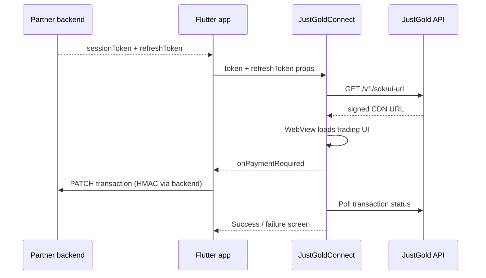

# Flutter SDK Integration

Embed the JustGold gold & silver trading UI in your Flutter app with **`justgold_sdk`** (^1.1.0) on [pub.dev](https://pub.dev/packages/justgold_sdk).

The wrapper loads the UI from **JustGold CDN** automatically — no separate UI deploy.

> **Start here:** [Mobile SDK Quickstart](sdk/quickstart.md) · **Prerequisites:** [Session Token](sdk/session-token.md)

---

## What you build vs what JustGold provides

| You build | JustGold provides |
| --- | --- |
| Backend session endpoint (HMAC) | Trading UI via CDN |
| Navigation to/from SDK screen | Buy, sell, delivery flows inside WebView |
| Payment collection UI | Quote preview, transaction creation |
| `PATCH /v1/transactions/:id` from backend | Invoice download, Help, FAQs |
| Token refresh when SDK asks | Silent JWT renewal (~60s before expiry) |

---

## How it works


```mermaid
sequenceDiagram
    participant Backend as Partner backend
    participant App as Flutter app
    participant SDK as JustGoldConnect
    participant JG as JustGold API

    Backend-->>App: sessionToken + refreshToken
    App->>SDK: token + refreshToken props
    SDK->>JG: GET /v1/sdk/ui-url
    JG-->>SDK: signed CDN URL
    SDK->>SDK: WebView loads trading UI
    SDK-->>App: onPaymentRequired
    App->>Backend: PATCH transaction (HMAC via backend)
    SDK->>JG: Poll transaction status
    SDK-->>App: Success / failure screen
```

- **No UI hosting** — wrapper fetches signed CDN URL from Partner API.
- **`sandbox: true`** → sandbox API + CDN; **`false`** (default) → production.
- Partners do **not** pass API base URLs or deploy the UI bundle.

---

## 1. Add the package

```yaml
dependencies:
  justgold_sdk: ^1.1.0
```

```bash
flutter pub get
```

**Platforms:** iOS and Android. Both use the same WebView-based trading UI.

---

## 2. Fetch a session from your backend

Do **not** put `client_secret` in the mobile app. Call **your** backend:

```json
{
  "sessionToken": "eyJhbGciOiJIUzI1NiIsInR5cCI6IkpXVCJ9...",
  "refreshToken": "g1ZmVyZXNoX3Rva2VuX2V4YW1wbGU..."
}
```

See [Session Token](sdk/session-token.md).

> **Development only:** The package includes optional `PartnerApiClient` helpers for local testing. **Never ship `clientSecret` in production builds.**

---

## 3. Minimal embed

```dart
import 'package:flutter/material.dart';
import 'package:justgold_sdk/justgold_sdk.dart';

class TradingPage extends StatelessWidget {
  const TradingPage({
    super.key,
    required this.token,
    required this.refreshToken,
    this.sandbox = false,
  });

  final String token;
  final String? refreshToken;
  final bool sandbox;

  @override
  Widget build(BuildContext context) {
    return JustGoldConnect(
      token: token,
      refreshToken: refreshToken,
      sandbox: sandbox,
      locale: 'en',
      theme: const SdkTheme(
        mode: SdkThemeMode.light,
        primaryColor: '#2563eb',
      ),
      onClose: () => Navigator.of(context).pop(),
      onSessionExpired: () => _refreshSession(context),
      onAuthRequired: (_) => _refreshSession(context),
      onTokensRefreshed: (payload) => _persistTokens(payload),
      onPaymentRequired: (payload, _) {
        Navigator.of(context).push(
          MaterialPageRoute(
            builder: (_) => PartnerPaymentPage(payload: payload),
          ),
        );
      },
      onError: (err) => debugPrint('SDK error: ${err['message']}'),
    );
  }
}
```

---

## 4. Complete production example

```dart
import 'package:flutter/material.dart';
import 'package:justgold_sdk/justgold_sdk.dart';

class TradingScreen extends StatefulWidget {
  const TradingScreen({
    super.key,
    required this.initialToken,
    this.initialRefreshToken,
    this.sandbox = false,
  });

  final String initialToken;
  final String? initialRefreshToken;
  final bool sandbox;

  @override
  State<TradingScreen> createState() => _TradingScreenState();
}

class _TradingScreenState extends State<TradingScreen> {
  late String _token = widget.initialToken;
  String? _refreshToken = widget.initialRefreshToken;

  Future<void> _reissueSession() async {
    final next = await yourBackend.fetchJustGoldSession();
    if (!mounted) return;
    setState(() {
      _token = next.sessionToken;
      _refreshToken = next.refreshToken;
    });
    await secureStorage.write(key: 'jg_refresh', value: next.refreshToken);
  }

  @override
  Widget build(BuildContext context) {
    return JustGoldConnect(
      key: ValueKey(_token),
      token: _token,
      refreshToken: _refreshToken,
      sandbox: widget.sandbox,
      locale: 'en',
      theme: const SdkTheme(
        mode: SdkThemeMode.light,
        primaryColor: '#2563eb',
        branding: PartnerBranding(
          partnerName: 'Your Brand',
          walletName: 'Gold Wallet',
          logoUrl: 'https://cdn.example.com/logo.png',
          // Optional — Help screen contacts (defaults match JustGold B2C app)
          // supportEmail: 'support@yourbrand.com',
          // supportPhone: '+971 589361909',
          // supportWhatsApp: '+971 589361909',
        ),
      ),
      allowNativeNavigation: false,
      logLevel: 'warn',
      onClose: () => Navigator.of(context).pop(),
      onSessionExpired: _reissueSession,
      onAuthRequired: (_) => _reissueSession(),
      onTokensRefreshed: (payload) {
        final sessionToken = payload['sessionToken'] as String?;
        final refreshToken = payload['refreshToken'] as String?;
        if (sessionToken == null) return;
        setState(() {
          _token = sessionToken;
          _refreshToken = refreshToken;
        });
        if (refreshToken != null) {
          secureStorage.write(key: 'jg_refresh', value: refreshToken);
        }
      },
      onPaymentRequired: (payload, _) {
        Navigator.of(context).push(
          MaterialPageRoute(
            builder: (_) => PartnerPaymentPage(payload: payload),
          ),
        );
      },
      onPartnerFeeRequest: (payload) async {
        return yourBackend.fetchPlatformFee(
          operation: payload['operation'] as String,
          metal: payload['metal'] as String?,
        );
      },
      onSuccess: (payload) => debugPrint('Transaction: $payload'),
      onNavigation: (payload) => debugPrint('Route: ${payload['route']}'),
      onError: (err) => debugPrint('SDK error [${err['code']}]: ${err['message']}'),
      onLog: (log) => debugPrint('[JustGold ${log['level']}] ${log['message']}'),
    );
  }
}
```

Use `key: ValueKey(_token)` so the WebView re-initializes after session replacement.

---

## 5. Partner payment screen example

```dart
import 'package:flutter/material.dart';
import 'package:justgold_sdk/justgold_sdk.dart';

class PartnerPaymentPage extends StatefulWidget {
  const PartnerPaymentPage({super.key, required this.payload});

  final PaymentRequiredPayload payload;

  @override
  State<PartnerPaymentPage> createState() => _PartnerPaymentPageState();
}

class _PartnerPaymentPageState extends State<PartnerPaymentPage> {
  bool _busy = false;

  Future<void> _complete(String status) async {
    setState(() => _busy = true);
    try {
      await yourBackend.updateTransactionStatus(
        transactionId: widget.payload.transactionId,
        status: status,
        paymentReference: 'your-psp-ref',
        paymentMethod: 'card',
      );
      if (mounted) Navigator.of(context).pop();
    } finally {
      if (mounted) setState(() => _busy = false);
    }
  }

  @override
  Widget build(BuildContext context) {
    final p = widget.payload;
    return Scaffold(
      appBar: AppBar(title: const Text('Complete payment')),
      body: Padding(
        padding: const EdgeInsets.all(24),
        child: Column(
          crossAxisAlignment: CrossAxisAlignment.start,
          children: [
            Text(
              '${p.currency} ${p.grandTotal.toStringAsFixed(2)}',
              style: Theme.of(context).textTheme.headlineMedium,
            ),
            const SizedBox(height: 8),
            Text('Transaction ${p.transactionId}'),
            Text('Type: ${p.type}'),
            const Spacer(),
            if (_busy)
              const Center(child: CircularProgressIndicator())
            else ...[
              FilledButton(
                onPressed: () => _complete('Completed'),
                child: const Text('Payment complete'),
              ),
              TextButton(
                onPressed: () => _complete('Failed'),
                child: const Text('Payment failed'),
              ),
            ],
          ],
        ),
      ),
    );
  }
}
```

Charge **`grandTotal`**, not `amount`. The `amount` field is the subtotal excluding fees.

---

## 6. Widget parameters & callbacks

| Parameter / callback | Description |
| --- | --- |
| `token` | **Required.** Session JWT from your backend |
| `refreshToken` | Enables silent token renewal |
| `sandbox` | `true` → sandbox API + CDN; `false` → production |
| `sdkUiSignedUrl` | Optional pre-signed CDN URL from your backend |
| `sdkUrl` | Optional UI URL override (advanced) |
| `locale` | `'en'` or `'ar'` |
| `theme` | `SdkTheme` — mode, colors, `PartnerBranding` |
| `logLevel` | `debug` \| `info` \| `warn` \| `error` |
| `platformFee` | Flat fee for quote previews |
| `allowNativeNavigation` | `false` (default) blocks system back / swipe-back |
| `onClose` | User closed the SDK |
| `onSessionExpired` | Re-issue session from your backend |
| `onAuthRequired` | Re-issue session (`payload['reason']`) |
| `onTokensRefreshed` | Persist new `refreshToken` |
| `onPaymentRequired` | `(payload, resume)` — open your payment UI |
| `onPartnerFeeRequest` | Return `PartnerFeeBreakup` or bare platform fee (`double?`) |
| `onSuccess` | Buy/sell/delivery complete |
| `onError` | `{ code, message }` |
| `onLog` | Structured log map |
| `onSdkEvent` | Catch-all outbound event as `Map` |

Payment payload fields: `transactionId`, `type` (`buy` \| `sell` \| `delivery`), `amount` (subtotal), `grandTotal` (charge amount), `currency`, `metal`, `quantity`, plus optional fee breakup fields.

---

## 7. Theming & branding

```dart
const SdkTheme(
  mode: SdkThemeMode.light,
  primaryColor: '#2563eb',
  branding: PartnerBranding(
    partnerName: 'Your Bank',
    walletName: 'Premier Gold Wallet',
    logoUrl: 'https://cdn.example.com/logo.png',
    supportEmail: 'support@yourbrand.com',
    supportPhone: '+971 589361909',
    supportWhatsApp: '+971 589361909',
  ),
)
```

| Branding field | Description |
| --- | --- |
| `partnerName` | Label in UI copy. Defaults to org name from API when omitted |
| `walletName` | Wallet label in payment flows |
| `logoUrl` | HTTPS partner logo |
| `supportEmail` | Help screen email. Default `support@justgold.app` |
| `supportPhone` | Help screen call button. Default `+971 589361909` |
| `supportWhatsApp` | Help screen WhatsApp. Defaults to `supportPhone` |

Logo URLs must be **HTTPS**.

---

## 8. Payment handoff

When the user confirms a quote, the SDK creates a **Pending** transaction and calls **`onPaymentRequired`**.

### Recommended: overlay (keep SDK mounted)

```dart
onPaymentRequired: (payload, _) {
  Navigator.of(context).push(
    MaterialPageRoute(
      builder: (_) => PartnerPaymentPage(payload: payload),
    ),
  );
},
// 1. Collect payment (your PSP / wallet)
// 2. PATCH /v1/transactions/:id from your backend (HMAC)
// 3. Navigator.pop — SDK polls and shows the result
```

### Unmounting during payment

If you must unmount `JustGoldConnect` (e.g. native PSP SDK), remount with the **same** `token` and `refreshToken`. The wrapper restores the payment route via session cache.

### Optional: `resume(transactionId)`

The second callback argument posts `PAYMENT_RESULT` for instant navigation. **Not required** for the overlay flow.

---

## 9. Dynamic platform fees

```dart
onPartnerFeeRequest: (payload) async {
  // Return flat platform fee:
  return 5.0;
  // Or full breakup for delivery orders:
  // return PartnerFeeBreakup(platformFee: 5.0, platformFeeTax: 0.25, ...);
  // Return null for org default from JustGold API
},
```

For delivery, the request includes `mintingFee` and `deliveryFee` totals so your backend can compute partner splits.

---

## 10. Native navigation

By default (`allowNativeNavigation: false`), the wrapper blocks Android system back and iOS WebView swipe-back. Users navigate with in-SDK header back/close only.

Set `allowNativeNavigation: true` to allow OS-level back gestures.

---

## 11. External links (invoice PDF, Help contacts)

The SDK UI emits **`OPEN_EXTERNAL_URL`** for invoice PDFs and Help screen links (`mailto:`, `tel:`, WhatsApp).

**`JustGoldConnect` opens these automatically** via `url_launcher` — no partner callback required.

Custom WebView hosts must handle the event manually — see [Bridge reference](sdk/bridge-events.md#open_external_url).

---

## 12. In-SDK features (SDK 1.1.0)

Partners do not implement these screens — they are included in the embedded UI:

| Route | Feature |
| --- | --- |
| `/` | Home — holdings, buy/sell/delivery shortcuts, FAQ carousel |
| `/help` | Support contacts (email, WhatsApp, call) |
| `/faqs` | Full FAQ list with expandable answers |
| `/returns-calculator` | Future returns estimator |
| `/transactions`, `/transactions/:id` | History and detail with invoice download |
| `/delivery/*` | Product catalog, cart, checkout, tracking |

Track navigation via `onSdkEvent` or `onNavigation` for analytics.

---

## 13. Environments

| Environment | Partner API | SDK CDN | `sandbox` |
| --- | --- | --- | --- |
| Sandbox | `https://api.stage.partner.justgold.app` | `https://sdk.stage.justgold.app` | `true` |
| Production | `https://api.partner.justgold.app` | `https://sdk.justgold.app` | `false` / omit |

---

## 14. Platform requirements

| Platform | Requirement |
| --- | --- |
| Android | `INTERNET` in **main** manifest (required for release APKs) |
| iOS | HTTPS under App Transport Security |
| Flutter | SDK `>=3.0.0`, Flutter `>=3.10.0` |

```xml
<!-- android/app/src/main/AndroidManifest.xml -->
<uses-permission android:name="android.permission.INTERNET"/>
```

---

## 15. Troubleshooting

| Symptom | Likely cause | Fix |
| --- | --- | --- |
| Blank WebView | Missing `INTERNET` on Android release | Add permission to main manifest |
| Session errors | Expired JWT, no refresh token | Pass `refreshToken`; implement `onAuthRequired` |
| Payment stuck | PATCH not called | Backend must PATCH `Completed` or `Failed` |
| Help links fail | Custom WebView | Use `JustGoldConnect` or handle `OPEN_EXTERNAL_URL` |
| Wrong API environment | Credential mismatch | Match `sandbox` to credential environment |

Enable debug logs:

```dart
JustGoldConnect(
  logLevel: 'debug',
  onLog: (log) => debugPrint('$log'),
)
```

---

## 16. Production checklist

- [ ] Session tokens from your backend only — `client_secret` never in the app
- [ ] `sandbox: false` for production builds
- [ ] Android `INTERNET` in main manifest
- [ ] Payment: `onPaymentRequired` → PATCH transaction → close payment screen
- [ ] Charge `grandTotal` in payment UI
- [ ] Test completed, failed, and cancelled paths in sandbox
- [ ] Confirm Android package ID and iOS bundle ID with JustGold onboarding
- [ ] Webhooks configured — see [Webhooks](../webhooks.md)

---

## Related docs

- [Mobile SDK Quickstart](sdk/quickstart.md)
- [Bridge events & payloads](sdk/bridge-events.md)
- [Session Token](sdk/session-token.md)
- [React Native integration](sdk/react-native.md)
- [SDK Overview](sdk/overview.md)
