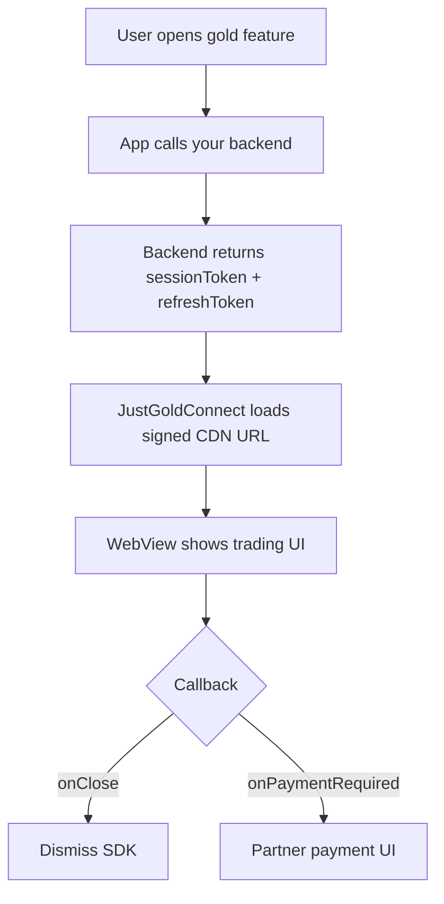

# Flutter SDK Integration

Embed the JustGold gold & silver trading UI in your Flutter app with **`justgold_sdk`** (^1.0.2) on [pub.dev](https://pub.dev/packages/justgold_sdk).

The wrapper loads the UI from **JustGold CDN** automatically — no separate UI deploy.

> **Prerequisites:** [Session Token](sdk/session-token.md) from your backend · [SDK Overview](sdk/overview.md)

## Integration shape


```mermaid
flowchart TD
    A[User opens gold feature] --> B[App calls your backend]
    B --> C[Backend returns sessionToken + refreshToken]
    C --> D[JustGoldConnect loads signed CDN URL]
    D --> E[WebView shows trading UI]
    E --> F{Callback}
    F -->|onClose| G[Dismiss SDK]
    F -->|onPaymentRequired| H[Partner payment UI]


```

Your backend still owns HMAC credentials and customer mapping. The mobile app receives only short-lived JWTs — see [Session Token](sdk/session-token.md).

---

## 1. Add the package

```yaml
dependencies:
  justgold_sdk: ^1.0.2
```

```bash
flutter pub get
```

---

## 2. Fetch a session from your backend

Do **not** put `client_secret` in the mobile app. Call **your** backend, which signs `POST /v1/customers/{customerIdentifier}/token` with HMAC and returns:

```json
{
  "sessionToken": "eyJhbGciOiJIUzI1NiIsInR5cCI6IkpXVCJ9...",
  "refreshToken": "g1ZmVyZXNoX3Rva2VuX2V4YW1wbGU..."
}
```

See [Session Token](sdk/session-token.md) and [Request Signing](../api/request-signing.md).

> **Development only:** The package includes optional `PartnerApiClient` helpers for local testing. **Never ship `clientSecret` in production app builds.**

---

## 3. Embed the SDK

```dart
import 'package:flutter/material.dart';
import 'package:justgold_sdk/justgold_sdk.dart';

class TradingPage extends StatelessWidget {
  const TradingPage({
    super.key,
    required this.token,
    required this.refreshToken,
    this.sandbox = false,
  });

  final String token;
  final String refreshToken;
  final bool sandbox;

  @override
  Widget build(BuildContext context) {
    return Scaffold(
      body: SafeArea(
        child: JustGoldConnect(
          token: token,
          refreshToken: refreshToken,
          sandbox: sandbox,
          locale: 'en',
          theme: const SdkTheme(
            mode: SdkThemeMode.light,
            primaryColor: '#2563eb',
          ),
          onClose: () => Navigator.of(context).pop(),
          onSessionExpired: () => _refreshSession(context),
          onAuthRequired: (_) => _refreshSession(context),
          onTokensRefreshed: (payload) => _persistTokens(payload),
          onPaymentRequired: (payload, _) {
            Navigator.of(context).push(
              MaterialPageRoute(
                builder: (_) => PartnerPaymentPage(payload: payload),
              ),
            );
          },
          onError: (error) => debugPrint('SDK error: $error'),
        ),
      ),
    );
  }
}
```

| Parameter | Notes |
| --- | --- |
| `sandbox` | `true` → sandbox API; omit or `false` → production |
| `locale` | `'en'` or `'ar'` |
| `theme` | Light/dark mode, brand colors, optional partner branding |
| `refreshToken` | Enables automatic silent renewal ~60s before JWT expiry |

Partners do **not** pass `apiBaseUrl` — the wrapper resolves it from the `sandbox` flag.

---

## 4. Widget parameters

| Parameter | Type | Description |
| --- | --- | --- |
| `token` | `String` | **Required.** Session JWT from your backend |
| `refreshToken` | `String?` | Optional refresh token for silent renewal |
| `sandbox` | `bool` | Sandbox vs production API (default `false`) |
| `locale` | `String?` | `'en'` or `'ar'` |
| `theme` | `SdkTheme?` | Mode, colors, partner branding |
| `platformFee` | `double?` | Optional flat platform fee for preview APIs |
| `logLevel` | `String?` | `debug` \| `info` \| `warn` \| `error` |
| `onClose` | `VoidCallback?` | User closed the SDK |
| `onSessionExpired` | `VoidCallback?` | Re-issue session from your backend |
| `onAuthRequired` | `AuthRequiredCallback?` | Re-issue session (`payload['reason']`) |
| `onTokensRefreshed` | `TokensRefreshedCallback?` | Persist new refresh token |
| `onPaymentRequired` | `PaymentRequiredCallback?` | Open partner payment UI — see below |
| `onPlatformFeeRequest` | `PlatformFeeCallback?` | Dynamic platform fee before preview |
| `onError` | `ErrorCallback?` | Unrecoverable SDK error |
| `onLog` | `LogCallback?` | Optional structured SDK logs |
| `sdkUiSignedUrl` | `String?` | Optional pre-signed CDN URL from your backend |
| `onSdkEvent` | `SdkEventCallback?` | Raw bridge events for advanced integrations |

### Theming

```dart
const SdkTheme(
  mode: SdkThemeMode.light,
  primaryColor: '#2563eb',
  branding: PartnerBranding(
    partnerName: 'Your Bank',
    logoUrl: 'https://cdn.example.com/logo.png',
    walletName: 'Your Wallet',
  ),
)
```

Logo URLs must be **HTTPS**.

---

## 5. Handle SDK callbacks

| Callback | When | Your action |
| --- | --- | --- |
| `onClose` | User taps close | `Navigator.pop` or dismiss |
| `onPaymentRequired` | User confirmed quote; payment is partner-side | Open payment UI → PATCH transaction status |
| `onPlatformFeeRequest` | SDK needs platform fee before preview | Return fee amount or `null` for org default |
| `onSessionExpired` / `onAuthRequired` | Session invalid or renew failed | Re-issue a fresh session from your backend |
| `onTokensRefreshed` | Silent renew succeeded | Persist new `refreshToken` |
| `onError` | SDK error | Log and show a recoverable message |

```dart
JustGoldConnect(
  token: sessionToken,
  refreshToken: refreshToken,
  onClose: () => Navigator.of(context).pop(),
  onSessionExpired: () async {
    final next = await fetchSessionFromBackend();
    if (!mounted) return;
    setState(() {
      sessionToken = next.sessionToken;
      refreshToken = next.refreshToken;
    });
  },
  onAuthRequired: (_) async {
    final next = await fetchSessionFromBackend();
    if (!mounted) return;
    setState(() {
      sessionToken = next.sessionToken;
      refreshToken = next.refreshToken;
    });
  },
  onPaymentRequired: (payload, resume) {
    Navigator.of(context).push(
      MaterialPageRoute(
        builder: (_) => PartnerPaymentPage(payload: payload),
      ),
    );
  },
  onPlatformFeeRequest: (payload) async {
    return await fetchPlatformFee(payload);
  },
  onError: (err) => debugPrint('SDK error: $err'),
)
```

---

## 6. Full-page payment

When the user confirms a buy, sell, or delivery quote, the SDK creates a **Pending** transaction and calls **`onPaymentRequired`**. Your app collects payment using your PCI-compliant stack, then updates status via the partner HMAC API:

```http
PATCH /v1/transactions/:transactionId
```

See [Transactions](../api/transactions.md).

### Recommended flow

Keep `JustGoldConnect` **mounted**. Push a full-screen payment route on top:

```dart
onPaymentRequired: (payload, _) {
  Navigator.of(context).push(
    MaterialPageRoute(builder: (_) => PartnerPaymentPage(payload: payload)),
  );
},
// 1. Collect payment (your PSP / wallet)
// 2. PATCH /v1/transactions/:id from your backend (HMAC)
// 3. Navigator.pop — SDK polls and shows the result
```

### Unmounting during payment

If you **unmount** `JustGoldConnect` during payment, remount it with the **same** `token` and `refreshToken` after PATCH. The `justgold_sdk` wrapper caches the session and restores the payment route via `resumePaymentTransactionId` on the next `INIT_SESSION`. Do **not** re-fetch tokens unless the session expired.

### Optional: `resume(transactionId)`

The second callback argument posts `PAYMENT_RESULT` for instant navigation. **Not required** for the recommended overlay flow or when remounting with the same session tokens.

---

## 7. Platform requirements

| Platform | Requirement |
| --- | --- |
| Android | `INTERNET` in **main** manifest (required for release APKs) |
| iOS | HTTPS under App Transport Security |
| Flutter | SDK `>=3.0.0`, Flutter `>=3.10.0` |

```xml
<!-- android/app/src/main/AndroidManifest.xml -->
<uses-permission android:name="android.permission.INTERNET"/>
```

---

## 8. SDK UI (CDN)

By default, `JustGoldConnect` fetches a signed URL from `GET /v1/sdk/ui-url`. See [Session Token — SDK UI URL](sdk/session-token.md#sdk-ui-signed-url-mobile).

Optional: pass `sdkUiSignedUrl` from your backend token response to skip the in-app fetch.

---

## 9. Permissions

The SDK does **not** declare sensitive device permissions (camera, location, contacts, biometrics).

Payment, KYC, and EFR flows outside the SDK use permissions your app declares separately.

---

## 10. Production checklist

- [ ] Session tokens issued from your backend only — `client_secret` never in the app
- [ ] `sandbox: false` for production builds
- [ ] Android `INTERNET` in main manifest
- [ ] `SafeArea` or correct inset context around `JustGoldConnect`
- [ ] SDK UI loads (not a blank screen)
- [ ] Payment flow: `onPaymentRequired` → PATCH transaction → close payment screen
- [ ] Test completed, cancelled, and error paths
- [ ] Confirm Android package ID and iOS bundle ID with JustGold onboarding
- [ ] Webhook and reconciliation configured — see [Webhooks](../webhooks.md)

---

## Related docs

- [SDK Overview](sdk/overview.md)
- [Bridge events & payloads](sdk/bridge-events.md) — all events with JSON examples
- [Session Token](sdk/session-token.md)
- [React Native integration](sdk/react-native.md)
- [Portal Access](../portal-access.md)
- [Webhooks](../webhooks.md)
