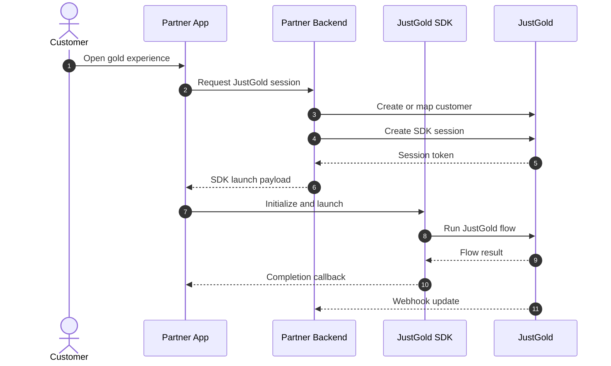

# SDK Integration

Use the SDK integration when you want to embed JustGold flows into a mobile app with less backend and UI work than a full API integration.

## When to use an SDK

Choose an SDK if you need:

- a faster mobile rollout
- a guided JustGold experience inside your app
- fewer custom screens for gold actions
- native app support for React Native or Flutter
- a cleaner handoff between your authenticated user and JustGold flows

## How the SDK path works

Your app starts the JustGold SDK from an authenticated user session. Your backend still owns partner credentials, customer mapping, and any server-side token or session exchange required for the SDK.

## SDK responsibilities

| Area | Partner app | Partner backend | JustGold SDK |
| --- | --- | --- | --- |
| User identity | Authenticates customer | Maps user to JustGold customer | Receives launch/session data |
| Credentials | Never stores secrets | Stores `client_id` and `client_secret` | Uses short-lived launch/session payload |
| Experience | Opens SDK and handles callbacks | Reconciles status | Presents JustGold mobile flow |
| Updates | Shows result state | Handles webhooks | Returns completion events |

## Platform guides

- [React Native integration](react-native.md)
- [Flutter integration](flutter.md)

## Before you build

Confirm these items with your JustGold onboarding contact:

- SDK package name and version
- environment values for sandbox and production
- session creation endpoint or backend contract
- supported mobile platforms
- callback event names and result payloads
- production launch checklist

## Next step

Choose your platform guide: [React Native](react-native.md) or [Flutter](flutter.md).
