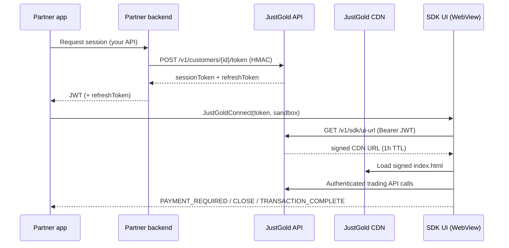

# SDK Integration

Use the SDK integration when you want to embed JustGold gold & silver trading into a mobile app with less backend and UI work than a full API integration.

## When to use an SDK

Choose an SDK if you need:

- a faster mobile rollout
- a guided JustGold experience inside your app
- fewer custom screens for gold actions
- native app support for React Native or Flutter
- a cleaner handoff between your authenticated user and JustGold flows

## SDK packages

| Platform | Package | Registry | UI hosting |
| --- | --- | --- | --- |
| React Native | `@justgold/rn-sdk` | [npm](https://www.npmjs.com/package/@justgold/rn-sdk) | JustGold CDN (signed URL via Partner API) |
| Flutter | `justgold_sdk` | [pub.dev](https://pub.dev/packages/justgold_sdk) | JustGold CDN (signed URL via Partner API) |
| Backend (all platforms) | `@justgold/partner-sdk` | [npm](https://www.npmjs.com/package/@justgold/partner-sdk) | Server-side HMAC signing only |

Both mobile SDKs embed the same trading UI via **`JustGoldConnect`**. Your app renders the component full-screen and handles callbacks — there is no separate `launch()` API.

**Partners do not sign CDN URLs or deploy the UI.** Mobile wrappers call `GET /v1/sdk/ui-url` with the session JWT automatically.

## API & CDN environments

| Environment | Partner API | SDK CDN (mobile UI) |
| --- | --- | --- |
| Dev / sandbox | `https://api.dev.partner.justgold.app` | `https://sdk.dev.justgold.app` |
| Stage | `https://api.stage.partner.justgold.app` | `https://sdk.stage.justgold.app` |
| Production | `https://api.partner.justgold.app` | `https://sdk.justgold.app` |

Pass `sandbox: true` (RN) or `sandbox: true` (Flutter) for dev/stage — partners do not configure `apiBaseUrl` in the client.

---

## Integration flow

```mermaid
sequenceDiagram
  participant App as Partner app
  participant API as Partner backend
  participant JG as JustGold API
  participant CDN as JustGold CDN
  participant UI as SDK UI (WebView)

  App->>API: Request session (your API)
  API->>JG: POST /v1/customers/{id}/token (HMAC)
  JG-->>API: sessionToken + refreshToken
  API-->>App: JWT (+ refreshToken)
  App->>UI: JustGoldConnect(token, sandbox)
  UI->>JG: GET /v1/sdk/ui-url (Bearer JWT)
  JG-->>UI: signed CDN URL (1h TTL)
  UI->>CDN: Load signed index.html
  UI->>JG: Authenticated trading API calls
  UI-->>App: PAYMENT_REQUIRED / CLOSE / TRANSACTION_COMPLETE
```

---

## Documentation

| Topic | Doc |
| --- | --- |
| Session token & UI URL | [Session Token](session-token.md) |
| **All bridge events + JSON payloads** | [Bridge events & payloads](bridge-events.md) |
| React Native | [React Native](react-native.md) |
| Flutter | [Flutter](flutter.md) |

The [Bridge events](bridge-events.md) page lists **every event with sample JSON payloads** and **React Native + Flutter handler examples** for each callback.

---

## Required callbacks (mobile)

| Event | Callback | Action |
| --- | --- | --- |
| `CLOSE` | `onClose` | Dismiss SDK screen |
| `SESSION_EXPIRED` / `AUTH_REQUIRED` | `onSessionExpired` / `onAuthRequired` | Re-issue session from your backend |
| `TOKENS_REFRESHED` | `onTokensRefreshed` | Persist new refresh token |
| `PAYMENT_REQUIRED` | `onPaymentRequired` | Open payment UI; PATCH transaction via HMAC API |

Optional: `onSuccess`, `onError`, `onLog`, `onPlatformFeeRequest`, `onSdkEvent` (catch-all analytics).

See [Bridge events](bridge-events.md) for full payload shapes.
