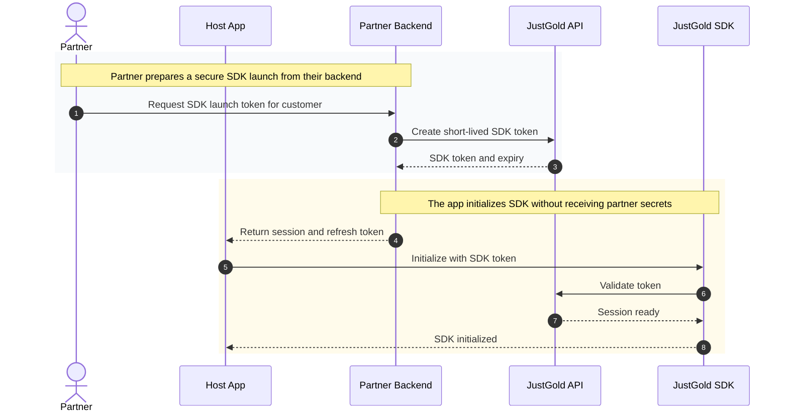
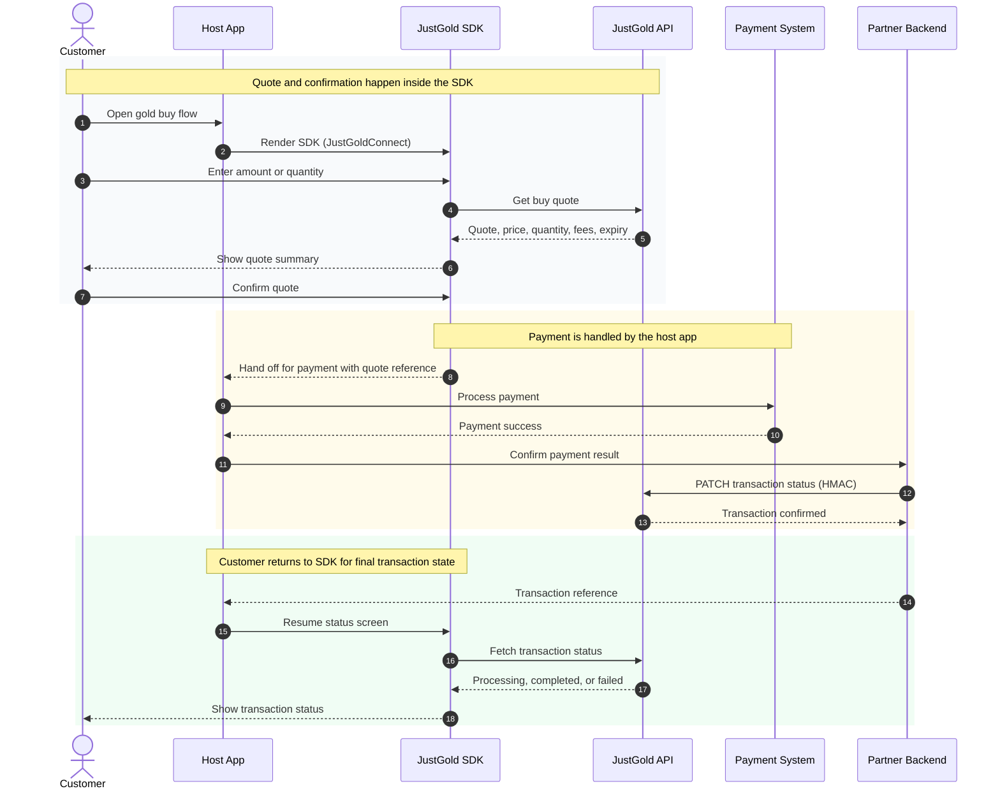
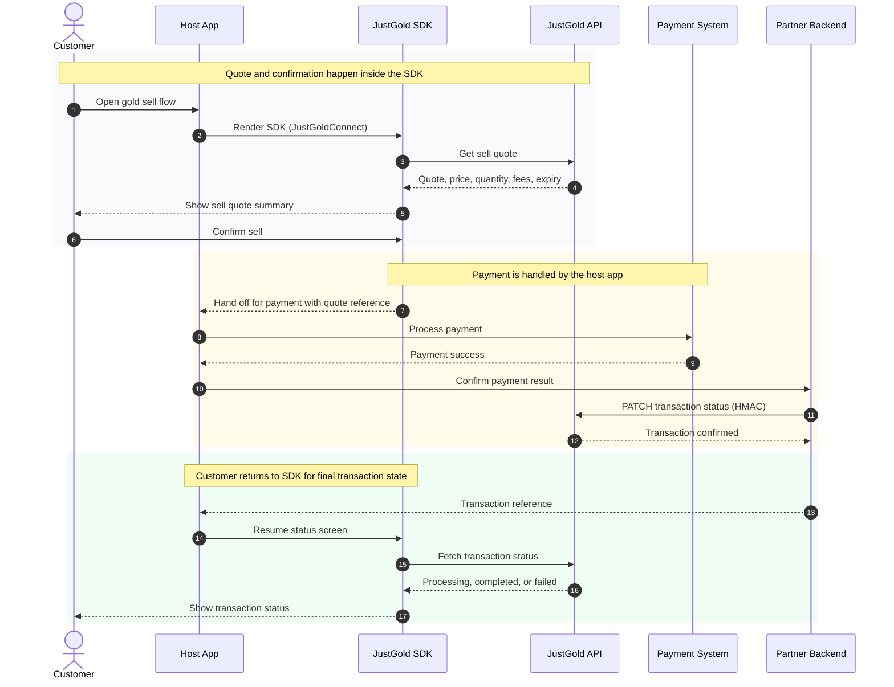
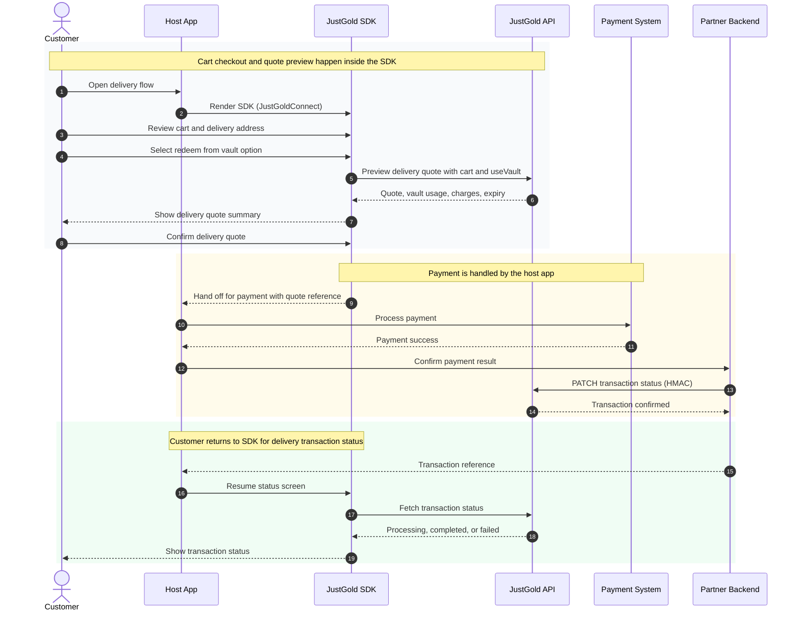

# SDK Integration

Use the SDK integration when you want to embed JustGold flows into a mobile app with less backend and UI work than a full API integration.

## When to use an SDK

Choose an SDK if you need:

- a faster mobile rollout
- a guided JustGold experience inside your app
- fewer custom screens for gold actions
- native app support for React Native or Flutter
- a cleaner handoff between your authenticated user and JustGold flows

## SDK packages

| Platform | Package | Registry | UI hosting |
| --- | --- | --- | --- |
| React Native | `@justgold/rn-sdk` | [npm](https://www.npmjs.com/package/@justgold/rn-sdk) | JustGold CDN (signed URL via Partner API) |
| Flutter | `justgold_sdk` | [pub.dev](https://pub.dev/packages/justgold_sdk) | JustGold CDN (signed URL via Partner API) |
| Backend (all platforms) | `@justgold/partner-sdk` | [npm](https://www.npmjs.com/package/@justgold/partner-sdk) | Server-side HMAC signing only |

Both mobile SDKs embed the same trading UI via **`JustGoldConnect`**. The wrapper fetches a short-lived signed CDN URL from `GET /v1/sdk/ui-url` — you do **not** host or deploy the UI yourself.

**Environments** (match backend credentials and SDK `sandbox` flag):

| Environment | Partner API | SDK CDN (signed) | `sandbox` |
| --- | --- | --- | --- |
| Sandbox | `https://api.stage.partner.justgold.app` | `https://sdk.stage.justgold.app` | `true` |
| Production | `https://api.partner.justgold.app` | `https://sdk.justgold.app` | `false` / omit |

Pass `sandbox: true` to the SDK component for sandbox integration — partners do not configure `apiBaseUrl` in the client.

---

## Sequence diagrams

Your app starts the JustGold SDK from an authenticated user session. Your backend still owns partner credentials, customer mapping, and any server-side token or session exchange required for the SDK.

### Initialize SDK sequence

The partner backend owns credentials and session creation. The mobile app receives only the short-lived token needed to initialize the SDK.


```mermaid
sequenceDiagram
    autonumber
    actor Partner as Partner
    participant Host as Host App
    participant Backend as Partner Backend
    participant JG as JustGold API
    participant SDK as JustGold SDK

    rect rgb(248, 250, 252)
        Note over Partner,Backend: Partner prepares a secure SDK launch from their backend
        Partner->>Backend: Request SDK launch token for customer
        Backend->>JG: Create short-lived SDK token
        JG-->>Backend: SDK token and expiry
    end

    rect rgb(255, 251, 235)
        Note over Backend,SDK: The app initializes SDK without receiving partner secrets
        Backend-->>Host: Return session and refresh token
        Host->>SDK: Initialize with SDK token
        SDK->>JG: Validate token
        JG-->>SDK: Session ready
        SDK-->>Host: SDK initialized
    end
```

### Buy sequence

The customer completes quote selection inside the SDK, moves to the host app for payment, then returns to the SDK for the transaction status screen after payment is processed.


```mermaid
sequenceDiagram
    autonumber
    actor Customer
    participant Host as Host App
    participant SDK as JustGold SDK
    participant JG as JustGold API
    participant Pay as Payment System
    participant Backend as Partner Backend

    rect rgb(248, 250, 252)
        Note over Customer,JG: Quote and confirmation happen inside the SDK
        Customer->>Host: Open gold buy flow
        Host->>SDK: Render SDK (JustGoldConnect)
        Customer->>SDK: Enter amount or quantity
        SDK->>JG: Get buy quote
        JG-->>SDK: Quote, price, quantity, fees, expiry
        SDK-->>Customer: Show quote summary
        Customer->>SDK: Confirm quote
    end

    rect rgb(255, 251, 235)
        Note over SDK,Pay: Payment is handled by the host app
        SDK-->>Host: Hand off for payment with quote reference
        Host->>Pay: Process payment
        Pay-->>Host: Payment success
        Host->>Backend: Confirm payment result
        Backend->>JG: PATCH transaction status (HMAC)
        JG-->>Backend: Transaction confirmed
    end

    rect rgb(240, 253, 244)
        Note over Host,SDK: Customer returns to SDK for final transaction state
        Backend-->>Host: Transaction reference
        Host->>SDK: Resume status screen
        SDK->>JG: Fetch transaction status
        JG-->>SDK: Processing, completed, or failed
        SDK-->>Customer: Show transaction status
    end
```

### Sell sequence


```mermaid
sequenceDiagram
    autonumber
    actor Customer
    participant Host as Host App
    participant SDK as JustGold SDK
    participant JG as JustGold API
    participant Pay as Payment System
    participant Backend as Partner Backend

    rect rgb(248, 250, 252)
        Note over Customer,JG: Quote and confirmation happen inside the SDK
        Customer->>Host: Open gold sell flow
        Host->>SDK: Render SDK (JustGoldConnect)
        SDK->>JG: Get sell quote
        JG-->>SDK: Quote, price, quantity, fees, expiry
        SDK-->>Customer: Show sell quote summary
        Customer->>SDK: Confirm sell
    end

    rect rgb(255, 251, 235)
        Note over SDK,Pay: Payment is handled by the host app
        SDK-->>Host: Hand off for payment with quote reference
        Host->>Pay: Process payment
        Pay-->>Host: Payment success
        Host->>Backend: Confirm payment result
        Backend->>JG: PATCH transaction status (HMAC)
        JG-->>Backend: Transaction confirmed
    end

    rect rgb(240, 253, 244)
        Note over Host,SDK: Customer returns to SDK for final transaction state
        Backend-->>Host: Transaction reference
        Host->>SDK: Resume status screen
        SDK->>JG: Fetch transaction status
        JG-->>SDK: Processing, completed, or failed
        SDK-->>Customer: Show transaction status
    end
```

### Delivery sequence


```mermaid
sequenceDiagram
    autonumber
    actor Customer
    participant Host as Host App
    participant SDK as JustGold SDK
    participant JG as JustGold API
    participant Pay as Payment System
    participant Backend as Partner Backend

    rect rgb(248, 250, 252)
        Note over Customer,JG: Cart checkout and quote preview happen inside the SDK
        Customer->>Host: Open delivery flow
        Host->>SDK: Render SDK (JustGoldConnect)
        Customer->>SDK: Review cart and delivery address
        Customer->>SDK: Select redeem from vault option
        SDK->>JG: Preview delivery quote with cart and useVault
        JG-->>SDK: Quote, vault usage, charges, expiry
        SDK-->>Customer: Show delivery quote summary
        Customer->>SDK: Confirm delivery quote
    end

    rect rgb(255, 251, 235)
        Note over SDK,Pay: Payment is handled by the host app
        SDK-->>Host: Hand off for payment with quote reference
        Host->>Pay: Process payment
        Pay-->>Host: Payment success
        Host->>Backend: Confirm payment result
        Backend->>JG: PATCH transaction status (HMAC)
        JG-->>Backend: Transaction confirmed
    end

    rect rgb(240, 253, 244)
        Note over Host,SDK: Customer returns to SDK for delivery transaction status
        Backend-->>Host: Transaction reference
        Host->>SDK: Resume status screen
        SDK->>JG: Fetch transaction status
        JG-->>SDK: Processing, completed, or failed
        SDK-->>Customer: Show transaction status
    end
```

## Host ↔ SDK communication

The SDK and host app communicate through a structured message bridge. The SDK emits events; the host responds via callbacks or by updating props.

### How it works

The SDK posts typed messages to the native layer through the platform wrapper. `@justgold/rn-sdk` and `justgold_sdk` deserialise these messages and invoke the corresponding callback you registered on `JustGoldConnect`.

```
SDK UI  ──event──▶  Native bridge  ──callback──▶  Host app
Host app  ──prop update / reply──▶  Native bridge  ──postMessage──▶  SDK UI
```

### SDK → Host events

| Event | Callback | Required? |
| --- | --- | --- |
| `PAYMENT_REQUIRED` | `onPaymentRequired` | **Yes** — collect payment, PATCH via backend |
| `SESSION_EXPIRED` | `onSessionExpired` | **Yes** — re-issue session |
| `AUTH_REQUIRED` | `onAuthRequired` | **Yes** — same as session expired |
| `TOKENS_REFRESHED` | `onTokensRefreshed` | **Recommended** — persist new refresh token |
| `CLOSE` | `onClose` | **Yes** — dismiss SDK screen |
| `PLATFORM_FEE_REQUEST` | `onPlatformFeeRequest` | If dynamic platform fee |
| `TRANSACTION_COMPLETE` | `onSuccess` | Optional |
| `ERROR` | `onError` | Recommended |

Use `onSdkEvent` (Flutter) or equivalent analytics hooks to receive optional events such as `QUOTE_PREVIEWED`, `TRANSACTION_CONFIRMED`, `NAVIGATION`, and `DELIVERY_COMPLETE`.

See **[Bridge events & payloads](sdk/bridge-events.md)** for every event with JSON examples and a full Flutter integration sample.

### Host → SDK messages

The host sends messages back via props or wrapper methods (most are handled automatically):

| Action | How | When to use |
| --- | --- | --- |
| Update session tokens | Update `token` / `refreshToken` props | After `onSessionExpired` / `onAuthRequired` |
| Report payment result | `resume(transactionId)` in `onPaymentRequired` | Optional fast-path after payment (polling works if SDK stays mounted) |
| Provide platform fee | Return value from `onPlatformFeeRequest` | In response to `PLATFORM_FEE_REQUEST` |

### Callback execution model

- Callbacks run on the **JS thread** (React Native) or **main isolate** (Flutter).
- `onPlatformFeeRequest` is async — the SDK awaits your returned fee before continuing.
- All other callbacks are fire-and-forget; the host drives next steps by updating props or calling `resume`.

---

## SDK responsibilities

| Area          | Partner app                     | Partner backend                        | JustGold SDK                            |
| ------------- | ------------------------------- | -------------------------------------- | --------------------------------------- |
| User identity | Authenticates customer          | Maps user to JustGold customer         | Receives launch/session data            |
| Credentials   | Never stores secrets            | Stores `client_id` and `client_secret` | Uses short-lived launch/session payload |
| Experience    | Opens SDK and handles callbacks | Reconciles status                      | Presents JustGold mobile flow           |
| Updates       | Shows result state              | Handles webhooks                       | Returns completion events               |

## Platform guides

- [Bridge events & payloads](sdk/bridge-events.md) — all events, JSON payloads, Flutter sample code
- [React Native integration](sdk/react-native.md)
- [Flutter integration](sdk/flutter.md)

## Before you build

1. **Backend session endpoint** — expose an app-facing route that returns `sessionToken` and `refreshToken`. See [Session Token](sdk/session-token.md).
2. **HMAC credentials** — store `client_id` and `client_secret` on your backend only. Use `@justgold/partner-sdk` for signing.
3. **Install the client package** — `@justgold/rn-sdk` ^1.0.2 or `justgold_sdk` ^1.0.2.
4. **Implement callbacks** — at minimum: `onClose`, `onSessionExpired` (or `onAuthRequired`), `onPaymentRequired`. See [Bridge events & payloads](sdk/bridge-events.md).
5. **Payment handoff** — PATCH `/v1/transactions/:id` from your backend after partner-side payment.
6. **Webhooks & reconciliation** — see [Webhooks](../webhooks.md).

Contact your JustGold onboarding team for sandbox credentials, bundle IDs, and production go-live approval.

## Next step

Choose your platform guide: [React Native](sdk/react-native.md) or [Flutter](sdk/flutter.md).
