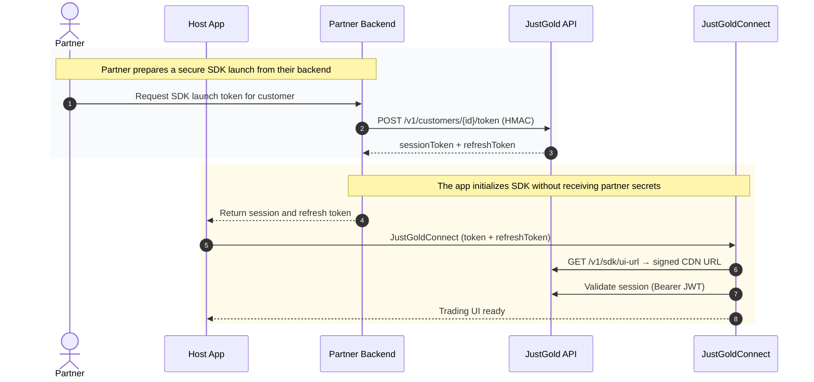
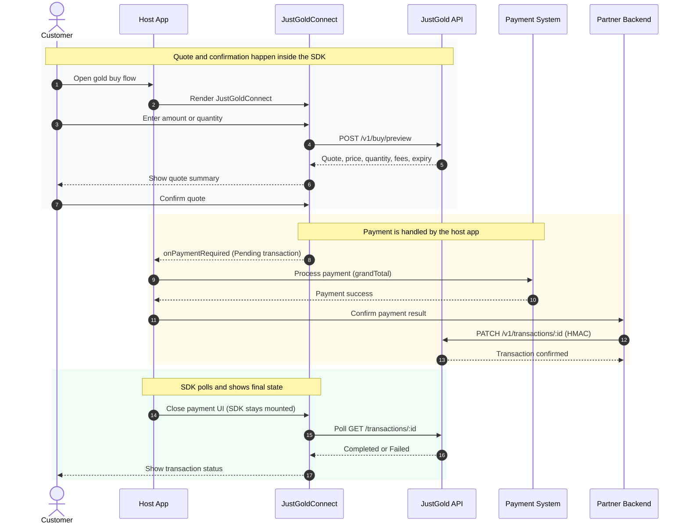

# SDK Integration

Use the SDK integration to embed JustGold gold & silver trading into your **React Native** or **Flutter** mobile app with minimal UI work.

> **New partner?** Start with the step-by-step guide: **[Mobile SDK Quickstart](sdk/quickstart.md)**

## When to use an SDK

Choose an SDK if you need:

- a faster mobile rollout
- a guided JustGold experience inside your app
- fewer custom screens for gold buy, sell, and delivery
- native app support for React Native or Flutter
- a clean handoff between your authenticated user and JustGold flows

## SDK packages (current: 1.1.0)

| Platform | Package | Registry | UI hosting |
| --- | --- | --- | --- |
| React Native | `@justgold/rn-sdk` ^1.1.0 | [npm](https://www.npmjs.com/package/@justgold/rn-sdk) | JustGold CDN (signed URL via Partner API) |
| Flutter | `justgold_sdk` ^1.1.0 | [pub.dev](https://pub.dev/packages/justgold_sdk) | JustGold CDN (signed URL via Partner API) |
| Backend (all platforms) | `@justgold/partner-sdk` | [npm](https://www.npmjs.com/package/@justgold/partner-sdk) | Server-side HMAC signing only |

Both mobile SDKs embed the same trading UI via **`JustGoldConnect`**. The wrapper fetches a short-lived signed CDN URL from `GET /v1/sdk/ui-url` — you do **not** host or deploy the UI yourself.

**Environments** (match backend credentials and SDK `sandbox` flag):

| Environment | Partner API | SDK CDN (signed) | `sandbox` |
| --- | --- | --- | --- |
| Sandbox | `https://api.stage.partner.justgold.app` | `https://sdk.stage.justgold.app` | `true` |
| Production | `https://api.partner.justgold.app` | `https://sdk.justgold.app` | `false` / omit |

Pass `sandbox: true` for sandbox integration — partners do not configure `apiBaseUrl` in the client.

---

## What's included in the embedded UI (1.1.0)

| Feature | Description |
| --- | --- |
| Buy / sell / delivery | Full quote → confirm → payment handoff flows |
| Transaction history | List and detail screens |
| Invoice download | Opens presigned PDF in device browser (automatic) |
| Help screen | Email, phone, WhatsApp support contacts |
| FAQs | Expandable accordion linked from home |
| Returns calculator | Future returns estimator |
| Localization | English and Arabic (`locale: 'en' \| 'ar'`) |
| White-label branding | Partner name, logo, wallet name, support contacts |

External links (invoice PDF, `mailto:`, `tel:`, WhatsApp) are handled **automatically** by `@justgold/rn-sdk` and `justgold_sdk` — no partner callback required.

---

## Sequence diagrams

Your app starts the JustGold SDK from an authenticated user session. Your backend still owns partner credentials, customer mapping, and server-side token exchange.

### Initialize SDK sequence


```mermaid
sequenceDiagram
    autonumber
    actor Partner as Partner
    participant Host as Host App
    participant Backend as Partner Backend
    participant JG as JustGold API
    participant SDK as JustGoldConnect

    rect rgb(248, 250, 252)
        Note over Partner,Backend: Partner prepares a secure SDK launch from their backend
        Partner->>Backend: Request SDK launch token for customer
        Backend->>JG: POST /v1/customers/{id}/token (HMAC)
        JG-->>Backend: sessionToken + refreshToken
    end

    rect rgb(255, 251, 235)
        Note over Backend,SDK: The app initializes SDK without receiving partner secrets
        Backend-->>Host: Return session and refresh token
        Host->>SDK: JustGoldConnect (token + refreshToken)
        SDK->>JG: GET /v1/sdk/ui-url → signed CDN URL
        SDK->>JG: Validate session (Bearer JWT)
        SDK-->>Host: Trading UI ready
    end
```

### Buy sequence


```mermaid
sequenceDiagram
    autonumber
    actor Customer
    participant Host as Host App
    participant SDK as JustGoldConnect
    participant JG as JustGold API
    participant Pay as Payment System
    participant Backend as Partner Backend

    rect rgb(248, 250, 252)
        Note over Customer,JG: Quote and confirmation happen inside the SDK
        Customer->>Host: Open gold buy flow
        Host->>SDK: Render JustGoldConnect
        Customer->>SDK: Enter amount or quantity
        SDK->>JG: POST /v1/buy/preview
        JG-->>SDK: Quote, price, quantity, fees, expiry
        SDK-->>Customer: Show quote summary
        Customer->>SDK: Confirm quote
    end

    rect rgb(255, 251, 235)
        Note over SDK,Pay: Payment is handled by the host app
        SDK-->>Host: onPaymentRequired (Pending transaction)
        Host->>Pay: Process payment (grandTotal)
        Pay-->>Host: Payment success
        Host->>Backend: Confirm payment result
        Backend->>JG: PATCH /v1/transactions/:id (HMAC)
        JG-->>Backend: Transaction confirmed
    end

    rect rgb(240, 253, 244)
        Note over Host,SDK: SDK polls and shows final state
        Host->>SDK: Close payment UI (SDK stays mounted)
        SDK->>JG: Poll GET /transactions/:id
        JG-->>SDK: Completed or Failed
        SDK-->>Customer: Show transaction status
    end
```

Sell and delivery follow the same payment handoff pattern — see sequence diagrams in [Bridge events](sdk/bridge-events.md).

---

## Host ↔ SDK communication

The SDK and host app communicate through a structured message bridge. The SDK emits events; the host responds via callbacks or by updating props.

```
SDK UI  ──event──▶  Native bridge  ──callback──▶  Host app
Host app  ──prop update / reply──▶  Native bridge  ──postMessage──▶  SDK UI
```

### SDK → Host events

| Event | Callback | Required? |
| --- | --- | --- |
| `PAYMENT_REQUIRED` | `onPaymentRequired` | **Yes** — collect payment, PATCH via backend |
| `SESSION_EXPIRED` | `onSessionExpired` | **Yes** — re-issue session |
| `AUTH_REQUIRED` | `onAuthRequired` | **Yes** — same as session expired |
| `TOKENS_REFRESHED` | `onTokensRefreshed` | **Recommended** — persist new refresh token |
| `CLOSE` | `onClose` | **Yes** — dismiss SDK screen |
| `PARTNER_FEE_REQUEST` | `onPartnerFeeRequest` | If dynamic platform fee |
| `TRANSACTION_COMPLETE` | `onSuccess` | Optional |
| `OPEN_EXTERNAL_URL` | — (automatic in RN/Flutter) | Handled by wrapper |
| `ERROR` | `onError` | Recommended |

Use `onSdkEvent` to receive optional events such as `QUOTE_PREVIEWED`, `TRANSACTION_CONFIRMED`, `NAVIGATION`, and `DELIVERY_COMPLETE`.

See **[Bridge events & payloads](sdk/bridge-events.md)** for every event with JSON examples.

### Host → SDK messages

| Action | How | When to use |
| --- | --- | --- |
| Update session tokens | Update `token` / `refreshToken` props | After `onSessionExpired` / `onAuthRequired` |
| Report payment result | `resume(transactionId)` in `onPaymentRequired` | Optional fast-path after payment |
| Provide platform fee | Return value from `onPartnerFeeRequest` | In response to `PARTNER_FEE_REQUEST` |

### Callback execution model

- Callbacks run on the **JS thread** (React Native) or **main isolate** (Flutter).
- `onPartnerFeeRequest` is async — the SDK awaits your returned fee before continuing.
- All other callbacks are fire-and-forget; the host drives next steps by updating props or calling `resume`.

---

## SDK responsibilities

| Area | Partner app | Partner backend | JustGold SDK |
| --- | --- | --- | --- |
| User identity | Authenticates customer | Maps user to JustGold customer | Receives launch/session data |
| Credentials | Never stores secrets | Stores `client_id` and `client_secret` | Uses short-lived session JWT |
| Experience | Opens SDK and handles callbacks | PATCHes transaction status (HMAC) | Presents JustGold mobile flow |
| Payment | Collects payment (`grandTotal`) | Confirms via `PATCH /v1/transactions/:id` | Polls status, shows result |
| Support links | — | — | Help, FAQs, invoice download (built-in) |
| Updates | Shows result state | Handles webhooks | Returns completion events |

---

## Platform guides

- **[Mobile SDK Quickstart](sdk/quickstart.md)** — four-step integration with copy-paste examples
- [React Native integration](sdk/react-native.md) — full props, payment screen, troubleshooting
- [Flutter integration](sdk/flutter.md) — full parameters, payment screen, troubleshooting
- [Bridge events & payloads](sdk/bridge-events.md) — all events, JSON payloads, fee breakup
- [Session Token](sdk/session-token.md) — backend token issuance and renewal

---

## Before you build

1. **Backend session endpoint** — expose an app-facing route that returns `sessionToken` and `refreshToken`. See [Session Token](sdk/session-token.md).
2. **HMAC credentials** — store `client_id` and `client_secret` on your backend only. Use `@justgold/partner-sdk` for signing.
3. **Install the client package** — `@justgold/rn-sdk` ^1.1.0 or `justgold_sdk` ^1.1.0.
4. **Implement callbacks** — at minimum: `onClose`, `onSessionExpired` (or `onAuthRequired`), `onPaymentRequired`. See [Bridge events](sdk/bridge-events.md).
5. **Payment handoff** — PATCH `/v1/transactions/:id` from your backend after partner-side payment. Charge `grandTotal`.
6. **Webhooks & reconciliation** — see [Webhooks](../webhooks.md).

Contact your JustGold onboarding team for sandbox credentials, bundle IDs, and production go-live approval.

## Next step

→ **[Mobile SDK Quickstart](sdk/quickstart.md)** — then choose [React Native](sdk/react-native.md) or [Flutter](sdk/flutter.md).
