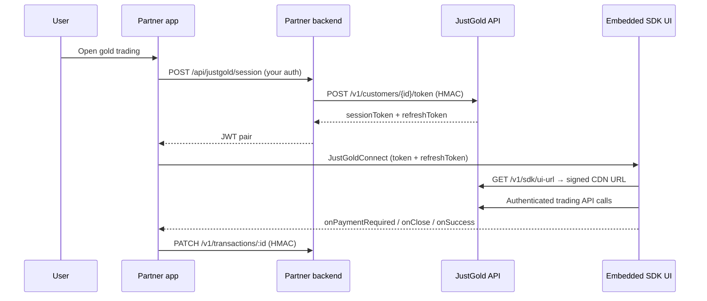

# Mobile SDK Quickstart

Integrate JustGold gold & silver trading into your **React Native** or **Flutter** app in four steps. Both platforms share the same backend flow and the same embedded UI — only the client package differs.

| Platform | Package | Version | Registry |
| --- | --- | --- | --- |
| React Native | `@justgold/rn-sdk` | ^1.1.0 | [npm](https://www.npmjs.com/package/@justgold/rn-sdk) |
| Flutter | `justgold_sdk` | ^1.1.0 | [pub.dev](https://pub.dev/packages/justgold_sdk) |
| Backend (all platforms) | `@justgold/partner-sdk` | ^1.0.0 | [npm](https://www.npmjs.com/package/@justgold/partner-sdk) |

> **You do not host the trading UI.** Mobile wrappers load it from JustGold CDN via a short-lived signed URL (`GET /v1/sdk/ui-url`). Your app only needs session tokens from your backend.

---

## Architecture



---

## Step 1 — Backend session endpoint

Store `client_id` and `client_secret` on your server only. Expose an app-facing route (example: `POST /api/justgold/session`) that:

1. Authenticates the logged-in user in your app
2. Maps them to a JustGold `customerIdentifier`
3. Signs and calls JustGold:

```ts
import { signRequest } from '@justgold/partner-sdk';

const customerId = 'your-user-id';
const path = `/v1/customers/${encodeURIComponent(customerId)}/token`;
const body = JSON.stringify({});

const headers = signRequest({
  method: 'POST',
  path,
  body,
  clientId: process.env.JUSTGOLD_CLIENT_ID!,
  secret: process.env.JUSTGOLD_CLIENT_SECRET!,
});

const res = await fetch(`${process.env.JUSTGOLD_API_BASE_URL}${path}`, {
  method: 'POST',
  headers: { 'Content-Type': 'application/json', ...headers },
  body,
});

const { sessionToken, refreshToken } = await res.json();
// Return { sessionToken, refreshToken } to your mobile app
```

**Never** put `client_secret` in mobile app code.

Full reference: [Session Token](sdk/session-token.md) · [Request Signing](../api/request-signing.md)

---

## Step 2 — Install the mobile package

### React Native

```bash
yarn add @justgold/rn-sdk@^1.1.0 react-native-webview react-native-safe-area-context
cd ios && pod install
```

Wrap your app (or SDK screen) in `SafeAreaProvider`.

### Flutter

```yaml
dependencies:
  justgold_sdk: ^1.1.0
```

```bash
flutter pub get
```

---

## Step 3 — Embed `JustGoldConnect`

Fetch tokens from **your backend** first, then render the SDK.

### React Native

```tsx
import { useCallback, useState } from 'react';
import { SafeAreaProvider } from 'react-native-safe-area-context';
import { JustGoldConnect, type PaymentRequiredPayload } from '@justgold/rn-sdk';

export function TradingScreen({ onDone }: { onDone: () => void }) {
  const [token, setToken] = useState<string | null>(null);
  const [refreshToken, setRefreshToken] = useState<string | undefined>();

  const loadSession = useCallback(async () => {
    const res = await fetch('https://your-api.com/api/justgold/session', {
      method: 'POST',
      headers: { Authorization: `Bearer ${yourAppJwt}` },
    });
    const data = await res.json();
    setToken(data.sessionToken);
    setRefreshToken(data.refreshToken);
  }, []);

  // Call loadSession() before showing this screen

  if (!token) return null;

  return (
    <SafeAreaProvider>
      <JustGoldConnect
        token={token}
        refreshToken={refreshToken}
        sandbox={false}
        locale="en"
        theme={{
          mode: 'light',
          primaryColor: '#2563eb',
          branding: {
            partnerName: 'Your Brand',
            walletName: 'Gold Wallet',
          },
        }}
        onClose={onDone}
        onSessionExpired={loadSession}
        onAuthRequired={loadSession}
        onTokensRefreshed={({ sessionToken, refreshToken: rt }) => {
          setToken(sessionToken);
          setRefreshToken(rt);
        }}
        onPaymentRequired={(payload: PaymentRequiredPayload) => {
          navigation.navigate('PartnerPayment', payload);
        }}
        onError={err => console.warn(err.message)}
      />
    </SafeAreaProvider>
  );
}
```

### Flutter

```dart
import 'package:flutter/material.dart';
import 'package:justgold_sdk/justgold_sdk.dart';

class TradingScreen extends StatefulWidget {
  const TradingScreen({super.key});

  @override
  State<TradingScreen> createState() => _TradingScreenState();
}

class _TradingScreenState extends State<TradingScreen> {
  String? _token;
  String? _refreshToken;

  Future<void> _loadSession() async {
    final data = await yourBackend.fetchJustGoldSession();
    setState(() {
      _token = data.sessionToken;
      _refreshToken = data.refreshToken;
    });
  }

  @override
  void initState() {
    super.initState();
    _loadSession();
  }

  @override
  Widget build(BuildContext context) {
    final token = _token;
    if (token == null) {
      return const Scaffold(body: Center(child: CircularProgressIndicator()));
    }

    return JustGoldConnect(
      token: token,
      refreshToken: _refreshToken,
      sandbox: false,
      locale: 'en',
      theme: const SdkTheme(
        mode: SdkThemeMode.light,
        primaryColor: '#2563eb',
        branding: PartnerBranding(partnerName: 'Your Brand'),
      ),
      onClose: () => Navigator.of(context).pop(),
      onSessionExpired: _loadSession,
      onAuthRequired: (_) => _loadSession(),
      onTokensRefreshed: (payload) {
        setState(() {
          _token = payload['sessionToken'] as String?;
          _refreshToken = payload['refreshToken'] as String?;
        });
      },
      onPaymentRequired: (payload, _) {
        Navigator.of(context).push(
          MaterialPageRoute(builder: (_) => PartnerPaymentPage(payload: payload)),
        );
      },
      onError: (err) => debugPrint('SDK error: ${err['message']}'),
    );
  }
}
```

---

## Step 4 — Handle payment

When the user confirms a quote, the SDK creates a **Pending** transaction and calls `onPaymentRequired`.

**Recommended:** keep `JustGoldConnect` mounted. Push your payment screen on top:

1. Collect payment with your PSP / wallet UI
2. Your backend `PATCH /v1/transactions/:id` with HMAC → `Completed` or `Failed`
3. Close your payment screen — the SDK polls every 2s and shows success/failure automatically

```dart
// Flutter payment screen skeleton
class PartnerPaymentPage extends StatelessWidget {
  const PartnerPaymentPage({super.key, required this.payload});
  final PaymentRequiredPayload payload;

  Future<void> _complete(BuildContext context, String status) async {
    await yourBackend.updateTransactionStatus(
      transactionId: payload.transactionId,
      status: status,
    );
    if (context.mounted) Navigator.of(context).pop();
  }

  @override
  Widget build(BuildContext context) {
    return Scaffold(
      appBar: AppBar(title: const Text('Complete payment')),
      body: Padding(
        padding: const EdgeInsets.all(24),
        child: Column(
          children: [
            Text('Charge: ${payload.currency} ${payload.grandTotal.toStringAsFixed(2)}'),
            Text('Transaction ${payload.transactionId}'),
            const Spacer(),
            FilledButton(
              onPressed: () => _complete(context, 'Completed'),
              child: const Text('Payment complete'),
            ),
          ],
        ),
      ),
    );
  }
}
```

Use `payload.grandTotal` (not `amount`) as the charge amount — `amount` is the subtotal excluding fees.

For **delivery** with mixed metals, read per-metal detail from `payload.metalSummary` — see [Bridge events](sdk/bridge-events.md#trading-amounts--metal-breakdown).

Full payment guide: [React Native — payment](sdk/react-native.md#payment-handoff) · [Flutter — payment](sdk/flutter.md#payment-handoff)

---

## Environments

Match your backend HMAC credentials to the SDK `sandbox` flag:

| Environment | Partner API | SDK CDN | `sandbox` prop |
| --- | --- | --- | --- |
| Sandbox / stage | `https://api.stage.partner.justgold.app` | `https://sdk.stage.justgold.app` | `true` |
| Production | `https://api.partner.justgold.app` | `https://sdk.justgold.app` | `false` / omit |

Partners do **not** pass `apiBaseUrl` — the wrapper resolves URLs from `sandbox`.

---

## Minimum callbacks checklist

| Callback | Required? | Purpose |
| --- | --- | --- |
| `onClose` | **Yes** | User dismissed the SDK |
| `onSessionExpired` / `onAuthRequired` | **Yes** | Re-fetch tokens from your backend |
| `onPaymentRequired` | **Yes** | Open partner payment UI |
| `onTokensRefreshed` | Recommended | Persist rotated refresh token |
| `onError` | Recommended | Log unrecoverable errors |
| `onPartnerFeeRequest` | If dynamic fees | Return platform fee before quote preview |

Invoice PDFs, Help screen links (`mailto:`, `tel:`, WhatsApp), and external URLs are handled **automatically** by the wrappers — no partner callback needed.

---

## What's included in SDK 1.1.0

The embedded UI includes:

- Buy, sell, and physical delivery flows
- Transaction history with **invoice download** (opens PDF in device browser)
- **Help** screen with email, phone, and WhatsApp support contacts
- **FAQ** accordion and returns calculator
- English and Arabic (`locale: 'en' | 'ar'`)
- Partner white-label branding via `theme.branding`

---

## Platform setup

### Android

Add to your **main** manifest (required for release APKs):

```xml
<uses-permission android:name="android.permission.INTERNET"/>
```

### iOS

Standard HTTPS (App Transport Security). No extra configuration for CDN mode.

---

## Production checklist

- [ ] Session tokens issued from your backend only — `client_secret` never in the app
- [ ] `sandbox={false}` (or omit) for production builds
- [ ] Android `INTERNET` permission in main manifest
- [ ] `onPaymentRequired` → PATCH transaction → close payment UI
- [ ] Test sandbox end-to-end before go-live
- [ ] Confirm app bundle ID / package name with JustGold onboarding
- [ ] Webhooks configured — see [Webhooks](../webhooks.md)

---

## Next steps

- [React Native integration (detailed)](sdk/react-native.md)
- [Flutter integration (detailed)](sdk/flutter.md)
- [Bridge events & payloads](sdk/bridge-events.md)
- [Session token reference](sdk/session-token.md)
