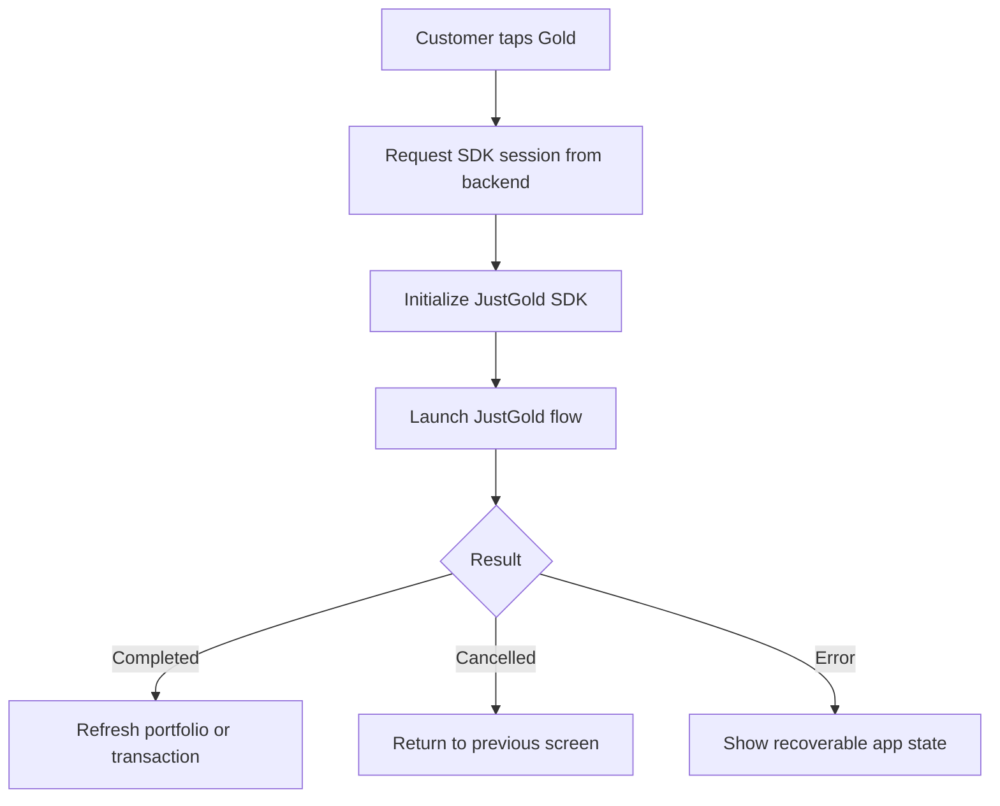

# React Native SDK Integration

Use this guide to add the JustGold SDK to a React Native app.

## Integration shape



## 1. Install the package

Use the SDK package and version provided during onboarding.

```bash
npm install @justgold/react-native-sdk
```

For iOS, install native dependencies after adding the package.

```bash
cd ios
pod install
```

## 2. Create a backend session endpoint

Do not place `client_secret` in the mobile app. Your app should call your backend, and your backend should create or fetch the customer and return a short-lived SDK launch payload.

Example app-facing response:

```json
{
  "environment": "sandbox",
  "sessionToken": "sdk_session_token",
  "customerRef": "partner_customer_reference"
}
```

## 3. Initialize the SDK

```tsx
import { JustGold } from '@justgold/react-native-sdk';

const justGold = new JustGold({
  environment: 'sandbox'
});
```

## 4. Launch the flow

```tsx
async function openGoldExperience() {
  const session = await fetch('/api/justgold/sdk-session').then((res) => res.json());

  const result = await justGold.launch({
    sessionToken: session.sessionToken,
    customerRef: session.customerRef
  });

  if (result.status === 'completed') {
    // Refresh holdings, transactions, or dashboard state.
  }
}
```

## 5. Handle results

Handle these states in your app:

| Result | Recommended app behavior |
| --- | --- |
| `completed` | Refresh customer holdings or transaction history |
| `cancelled` | Return the customer to the previous screen without creating an error state |
| `error` | Show a retry path and log the SDK error code |

## 6. Production checklist

- Use production environment values
- Confirm app signing and bundle identifiers with JustGold
- Verify Android and iOS builds
- Test completed, cancelled, and error callbacks
- Confirm backend webhook handling
- Confirm transaction reconciliation in your dashboard

## Related docs

- [SDK Overview](overview.md)
- [Portal Access](../portal-access.md)
- [Webhooks](../webhooks.md)
