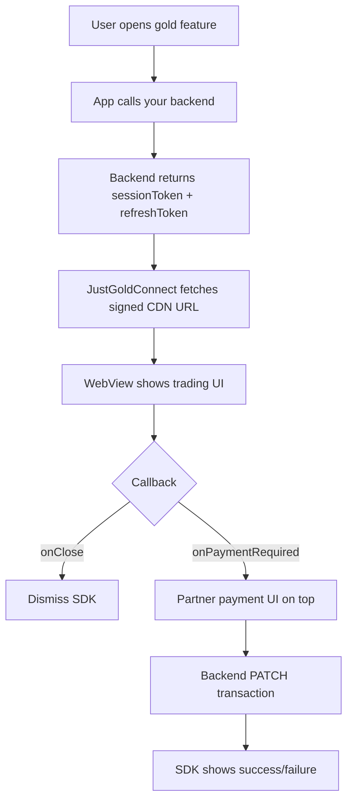

# React Native SDK Integration

Embed the JustGold gold & silver trading UI in your React Native app with **`@justgold/rn-sdk`** (^1.1.1).

The wrapper loads the UI from **JustGold CDN** automatically — no separate UI deploy, no `sdkUrl` in normal integration.

> **Start here:** [Mobile SDK Quickstart](sdk/quickstart.md) · **Prerequisites:** [Session Token](sdk/session-token.md)

---

## What you build vs what JustGold provides

| You build | JustGold provides |
| --- | --- |
| Backend session endpoint (HMAC) | Trading UI via CDN |
| Navigation to/from SDK screen | Buy, sell, delivery flows inside WebView |
| Payment collection UI | Quote preview, transaction creation |
| `PATCH /v1/transactions/:id` from backend | Invoice download, Help, FAQs |
| Token refresh when SDK asks | Silent JWT renewal (~60s before expiry) |

---

## Integration shape


```mermaid
flowchart TD
    A[User opens gold feature] --> B[App calls your backend]
    B --> C[Backend returns sessionToken + refreshToken]
    C --> D[JustGoldConnect fetches signed CDN URL]
    D --> E[WebView shows trading UI]
    E --> F{Callback}
    F -->|onClose| G[Dismiss SDK]
    F -->|onPaymentRequired| H[Partner payment UI on top]
    H --> I[Backend PATCH transaction]
    I --> J[SDK shows success/failure]
```

---

## 1. Install

```bash
yarn add @justgold/rn-sdk@^1.1.1 react-native-webview react-native-safe-area-context
# or
npm install @justgold/rn-sdk@^1.1.1 react-native-webview react-native-safe-area-context
```

### Peer dependencies

| Package | Version |
| --- | --- |
| `react` | >= 18 |
| `react-native` | >= 0.70 |
| `react-native-webview` | >= 13 |
| `react-native-safe-area-context` | >= 4 |

### iOS

```bash
cd ios && pod install
```

Wrap your app (or SDK screen) in `SafeAreaProvider`:

```tsx
import { SafeAreaProvider } from 'react-native-safe-area-context';
```

---

## 2. Fetch a session from your backend

Do **not** put `client_secret` in the mobile app. Call **your** backend, which signs `POST /v1/customers/{customerIdentifier}/token` with HMAC:

```json
{
  "sessionToken": "eyJhbGciOiJIUzI1NiIsInR5cCI6IkpXVCJ9...",
  "refreshToken": "g1ZmVyZXNoX3Rva2VuX2V4YW1wbGU..."
}
```

See [Session Token](sdk/session-token.md).

---

## 3. Minimal embed

```tsx
import { SafeAreaProvider } from 'react-native-safe-area-context';
import { JustGoldConnect } from '@justgold/rn-sdk';

export function TradingScreen({ jwt, refreshToken, onDone }: Props) {
  return (
    <SafeAreaProvider>
      <JustGoldConnect
        token={jwt}
        refreshToken={refreshToken}
        sandbox={false}
        locale="en"
        theme={{ mode: 'light', primaryColor: '#2563eb' }}
        onClose={onDone}
        onSessionExpired={() => refreshSessionFromBackend()}
        onAuthRequired={() => refreshSessionFromBackend()}
        onTokensRefreshed={({ sessionToken, refreshToken: rt }) => persistTokens(sessionToken, rt)}
        onPaymentRequired={(payload) => navigation.navigate('PartnerPayment', payload)}
        onError={(err) => console.warn(err.message)}
      />
    </SafeAreaProvider>
  );
}
```

| Prop | Notes |
| --- | --- |
| `sandbox` | `true` → sandbox API + CDN; omit or `false` → production |
| `locale` | `'en'` or `'ar'` |
| `refreshToken` | Enables automatic silent renewal ~60s before JWT expiry |

Partners do **not** pass `apiBaseUrl` — the wrapper resolves it from `sandbox`.

---

## 4. Complete production example

Production apps should hold tokens in React state and refresh when the SDK asks:

```tsx
import { useCallback, useEffect, useState } from 'react';
import { ActivityIndicator, View } from 'react-native';
import { SafeAreaProvider } from 'react-native-safe-area-context';
import {
  JustGoldConnect,
  type PaymentRequiredPayload,
  type SdkTheme,
} from '@justgold/rn-sdk';

type Props = {
  sandbox?: boolean;
  onDone: () => void;
};

export function TradingScreen({ sandbox = false, onDone }: Props) {
  const [token, setToken] = useState<string | null>(null);
  const [refreshToken, setRefreshToken] = useState<string | undefined>();
  const [loading, setLoading] = useState(true);
  const [error, setError] = useState<string | null>(null);

  const reissueSession = useCallback(async () => {
    const next = await yourBackend.fetchJustGoldSession();
    setToken(next.sessionToken);
    setRefreshToken(next.refreshToken);
    await secureStorage.set('jg_refresh', next.refreshToken);
  }, []);

  useEffect(() => {
    reissueSession()
      .catch(e => setError(e instanceof Error ? e.message : 'Session failed'))
      .finally(() => setLoading(false));
  }, [reissueSession]);

  if (loading) {
    return (
      <View style={{ flex: 1, justifyContent: 'center', alignItems: 'center' }}>
        <ActivityIndicator />
      </View>
    );
  }

  if (error || !token) {
    return null; // show your error UI
  }

  const theme: SdkTheme = {
    mode: 'light',
    primaryColor: '#2563eb',
    branding: {
      partnerName: 'Your Brand',
      walletName: 'Gold Wallet',
      logoUrl: 'https://cdn.example.com/logo.png',
      // Optional — Help screen contacts (defaults match JustGold B2C app)
      // supportEmail: 'support@yourbrand.com',
      // supportPhone: '+971 589361909',
      // supportWhatsApp: '+971 589361909',
    },
  };

  return (
    <SafeAreaProvider>
      <JustGoldConnect
        key={token}
        token={token}
        refreshToken={refreshToken}
        sandbox={sandbox}
        locale="en"
        theme={theme}
        logLevel="warn"
        allowNativeNavigation={false}
        onClose={onDone}
        onSessionExpired={reissueSession}
        onAuthRequired={reissueSession}
        onTokensRefreshed={({ sessionToken, refreshToken: rt }) => {
          setToken(sessionToken);
          setRefreshToken(rt);
          if (rt) secureStorage.set('jg_refresh', rt);
        }}
        onPaymentRequired={(payload: PaymentRequiredPayload) => {
          navigation.navigate('PartnerPayment', {
            transactionId: payload.transactionId,
            chargeAmount: payload.grandTotal,
            currency: payload.currency,
            type: payload.type,
          });
        }}
        onPartnerFeeRequest={async ({ operation, metal }) => {
          return yourBackend.fetchPlatformFee(operation, metal);
        }}
        onSuccess={txn => analytics.track('justgold_complete', txn)}
        onNavigation={({ route }) => analytics.track('justgold_route', { route })}
        onError={err => console.warn(`SDK [${err.code}]:`, err.message)}
        onLog={({ level, message }) => console.log(`[JustGold ${level}]`, message)}
      />
    </SafeAreaProvider>
  );
}
```

Use `key={token}` so the WebView re-initializes when you replace the session after expiry.

---

## 5. Partner payment screen example

```tsx
import { useState } from 'react';
import { View, Text, Button, ActivityIndicator } from 'react-native';
import type { PaymentRequiredPayload } from '@justgold/rn-sdk';

type Props = {
  payload: PaymentRequiredPayload;
  onDone: () => void;
};

export function PartnerPaymentScreen({ payload, onDone }: Props) {
  const [busy, setBusy] = useState(false);

  async function complete(status: 'Completed' | 'Failed') {
    setBusy(true);
    try {
      await yourBackend.patchTransaction(payload.transactionId, {
        status,
        paymentReference: 'your-psp-ref',
        paymentMethod: 'card',
      });
      onDone(); // navigation.goBack() — SDK polls and shows result
    } finally {
      setBusy(false);
    }
  }

  return (
    <View style={{ flex: 1, padding: 24 }}>
      <Text style={{ fontSize: 24, fontWeight: '600' }}>
        {payload.currency} {payload.grandTotal.toFixed(2)}
      </Text>
      <Text>Transaction {payload.transactionId}</Text>
      <Text>Type: {payload.type}</Text>
      {busy ? (
        <ActivityIndicator />
      ) : (
        <>
          <Button title="Payment complete" onPress={() => complete('Completed')} />
          <Button title="Payment failed" onPress={() => complete('Failed')} />
        </>
      )}
    </View>
  );
}
```

Charge the customer **`grandTotal`**, not `amount`. The `amount` field is the subtotal excluding fees.

For **delivery** orders with both gold and silver, use `payload.metalSummary.gold` and `payload.metalSummary.silver` for per-metal grams and metal value. Top-level `metal` / `quantity` remain for backward compatibility.

---

## 6. Component props

| Prop | Type | Description |
| --- | --- | --- |
| `token` | `string` | **Required.** Session JWT from your backend |
| `refreshToken` | `string` | Optional refresh token for silent renewal |
| `sandbox` | `boolean` | `true` → sandbox API + CDN; omit/`false` → production |
| `locale` | `string` | `'en'` or `'ar'` |
| `theme` | `SdkTheme` | Mode, colors, `PartnerBranding` |
| `platformFee` | `number` | Flat fee for quote previews; omit for dynamic/org default |
| `allowNativeNavigation` | `boolean` | `false` (default) blocks Android back and iOS swipe-back |
| `logLevel` | `SdkLogLevel` | `debug` \| `info` \| `warn` \| `error` (default `warn`) |
| `sdkUrl` | `string` | Optional CDN URL override (advanced) |
| `sdkUiSignedUrl` | `string` | Optional pre-signed CDN URL from your backend |
| `sessionRenewDelayMs` | `number` | **Testing only** — omit in production |
| `onClose` | `() => void` | User closed SDK |
| `onSessionExpired` | `() => void` | Re-issue session |
| `onAuthRequired` | `(payload) => void` | Re-issue session (`reason` in payload) |
| `onTokensRefreshed` | `(payload) => void` | Persist new refresh token |
| `onPaymentRequired` | `(payload, resume) => void` | Open partner payment UI |
| `onPartnerFeeRequest` | `(payload) => PartnerFeeBreakup \| number \| null \| Promise<…>` | Dynamic platform fee before preview |
| `onSuccess` | `(payload) => void` | `TRANSACTION_COMPLETE` |
| `onNavigation` | `(payload) => void` | In-SDK route changes (analytics) |
| `onQuotePreviewed` | `(payload) => void` | Preview API succeeded |
| `onTransactionConfirmed` | `(payload) => void` | Transaction created (usually `Pending`) |
| `onDeliveryComplete` | `(payload) => void` | Delivery order placed |
| `onError` | `(payload) => void` | `{ code, message }` |
| `onLog` | `(payload) => void` | Structured SDK logs |
| `onSdkEvent` | `(event) => void` | Catch-all for every outbound event |

Import typed payloads from `@justgold/rn-sdk` or `@justgold/sdk-bridge`:

```tsx
import type {
  PaymentRequiredPayload,
  PartnerFeeRequestPayload,
  TokensRefreshedPayload,
} from '@justgold/rn-sdk';
```

---

## 7. Theming & branding

```tsx
const theme: SdkTheme = {
  mode: 'light',
  primaryColor: '#2563eb',
  branding: {
    partnerName: 'Your Bank',
    walletName: 'Premier Gold Wallet',
    logoUrl: 'https://cdn.example.com/logo.png',
    supportEmail: 'support@yourbrand.com',
    supportPhone: '+971 589361909',
    supportWhatsApp: '+971 589361909',
  },
};
```

| Branding field | Description |
| --- | --- |
| `partnerName` | Label in UI copy. Defaults to org name from API when omitted |
| `walletName` | Wallet label in payment flows. Defaults to `"{partnerName} Wallet"` |
| `logoUrl` | HTTPS partner logo |
| `supportEmail` | Help screen email. Default `support@justgold.app` |
| `supportPhone` | Help screen call button. Default `+971 589361909` |
| `supportWhatsApp` | Help screen WhatsApp. Defaults to `supportPhone` |

Logo URLs must be **HTTPS**.

---

## 8. Payment handoff

When the user confirms a buy, sell, or delivery quote, the SDK creates a **Pending** transaction and emits **`PAYMENT_REQUIRED`** (handled via `onPaymentRequired`).

### Recommended flow (overlay)

Keep `JustGoldConnect` **mounted**. Push payment UI on top:

```tsx
onPaymentRequired={(payload) => navigation.navigate('PartnerPayment', payload)}

// PartnerPayment screen:
// 1. Collect payment (your PSP / wallet)
// 2. PATCH /v1/transactions/:id from your backend (HMAC)
// 3. navigation.goBack() — SDK shows success/failure automatically
```

The SDK polls transaction status every 2s on its internal pending screen.

### Unmounting during payment

If you **must unmount** `JustGoldConnect` (e.g. native PSP SDK), remount with the **same** `token` and `refreshToken` after PATCH. The wrapper caches the session and restores the payment route. Do **not** re-fetch tokens unless expired.

### Optional: `resume(transactionId)`

The second argument to `onPaymentRequired` posts `PAYMENT_RESULT` for instant navigation. **Not required** when the SDK stays mounted.

---

## 9. Dynamic platform fees

Three ways to supply platform fee before buy/sell/delivery preview:

1. **Static** — `platformFee={5.0}` prop
2. **Imperative** — `connectRef.current?.setPlatformFee(5.0)`
3. **Dynamic** — `onPartnerFeeRequest` callback

```tsx
onPartnerFeeRequest={async ({ operation, metal, mintingFee, deliveryFee }) => {
  // Return flat platform fee, or full breakup for delivery:
  return {
    platformFee: 5.0,
    platformFeeTax: 0.25,
    mintingFeeToJustGold: 31.5,
    mintingFeeToSp: 13.5,
  };
  // Legacy: return 5.0 for platform fee only
  // Return null to use org default from JustGold API
}}
```

If your callback throws or times out (8s), the SDK falls back to the org default fee.

---

## 10. Native navigation

By default (`allowNativeNavigation={false}`), the wrapper blocks Android hardware back and iOS WebView swipe-back. Users navigate with in-SDK header back/close only.

Set `allowNativeNavigation={true}` to allow OS-level back gestures in addition to SDK controls.

In-SDK navigation uses explicit routes (e.g. Home → FAQs → Help) — not browser history back — so behaviour stays predictable inside WebViews.

---

## 11. External links (invoice PDF, Help contacts)

The SDK UI opens invoice PDFs and Help screen links (`mailto:`, `tel:`, WhatsApp) via the **`OPEN_EXTERNAL_URL`** bridge event.

**`JustGoldConnect` handles this automatically** with `Linking.openURL` — no partner callback required.

If you embed a custom WebView instead of `JustGoldConnect`, handle `OPEN_EXTERNAL_URL` yourself — see [Bridge reference](sdk/bridge-events.md#open_external_url).

---

## 12. Environments

| Environment | Partner API | SDK CDN | `sandbox` |
| --- | --- | --- | --- |
| Sandbox | `https://api.stage.partner.justgold.app` | `https://sdk.stage.justgold.app` | `true` |
| Production | `https://api.partner.justgold.app` | `https://sdk.justgold.app` | `false` / omit |

---

## 13. Platform setup

### Android

```xml
<!-- android/app/src/main/AndroidManifest.xml -->
<uses-permission android:name="android.permission.INTERNET"/>
```

Without this permission, CDN and API calls fail in release APKs.

### iOS

Standard HTTPS (App Transport Security). No ATS exceptions required.

---

## 14. Troubleshooting

| Symptom | Likely cause | Fix |
| --- | --- | --- |
| Blank WebView | Missing `INTERNET` on Android release | Add permission to main manifest |
| `401` / session errors | Expired JWT, no refresh token | Pass `refreshToken`; implement `onAuthRequired` |
| Payment stuck on pending | PATCH not called or wrong status | Backend must PATCH `Completed` or `Failed` |
| Help links don't work | Custom WebView without bridge handler | Use `JustGoldConnect` or handle `OPEN_EXTERNAL_URL` |
| Wrong environment | Sandbox credentials with `sandbox={false}` | Match SDK flag to credential environment |

Enable debug logs during integration:

```tsx
<JustGoldConnect logLevel="debug" onLog={log => console.log(log)} />
```

---

## 15. Production checklist

- [ ] Session tokens from your backend only — `client_secret` never in the app
- [ ] `sandbox={false}` (or omit) for production builds
- [ ] `SafeAreaProvider` wraps `JustGoldConnect`
- [ ] Android `INTERNET` in main manifest
- [ ] Payment: `onPaymentRequired` → PATCH transaction → close payment UI
- [ ] Charge `grandTotal` in payment UI
- [ ] Test completed, failed, and cancelled paths in sandbox
- [ ] Confirm bundle ID / package name with JustGold onboarding
- [ ] Webhooks configured — see [Webhooks](../webhooks.md)

---

## Related docs

- [Mobile SDK Quickstart](sdk/quickstart.md)
- [Bridge events & payloads](sdk/bridge-events.md)
- [Session Token](sdk/session-token.md)
- [Flutter integration](sdk/flutter.md)
- [SDK Overview](sdk/overview.md)
