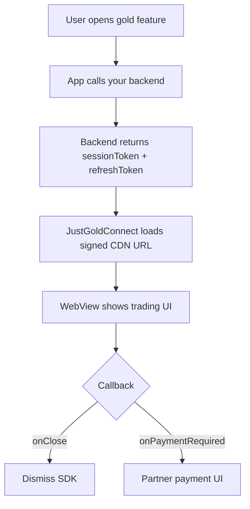

# React Native SDK Integration

Embed the JustGold gold & silver trading UI in your React Native app with **`@justgold/rn-sdk`** (^1.0.2).

The wrapper loads the UI from **JustGold CDN** automatically — no separate UI deploy.

> **Prerequisites:** [Session Token](sdk/session-token.md) from your backend · [SDK Overview](sdk/overview.md)

## Integration shape


```mermaid
flowchart TD
    A[User opens gold feature] --> B[App calls your backend]
    B --> C[Backend returns sessionToken + refreshToken]
    C --> D[JustGoldConnect loads signed CDN URL]
    D --> E[WebView shows trading UI]
    E --> F{Callback}
    F -->|onClose| G[Dismiss SDK]
    F -->|onPaymentRequired| H[Partner payment UI]


```

Your backend still owns HMAC credentials and customer mapping. The mobile app receives only short-lived JWTs — see [Session Token](sdk/session-token.md).

---

## 1. Install the package

```bash
npm install @justgold/rn-sdk@^1.0.2 react-native-webview react-native-safe-area-context
# or
yarn add @justgold/rn-sdk@^1.0.2 react-native-webview react-native-safe-area-context
```

### Peer dependencies

| Package | Version |
| --- | --- |
| `react` | >= 18 |
| `react-native` | >= 0.70 |
| `react-native-webview` | >= 13 |
| `react-native-safe-area-context` | >= 4 |

### iOS

Install native dependencies after adding the packages:

```bash
cd ios && pod install
```

---

## 2. Fetch a session from your backend

Do **not** put `client_secret` in the mobile app. Call **your** backend, which signs `POST /v1/customers/{customerIdentifier}/token` with HMAC and returns:

```json
{
  "sessionToken": "eyJhbGciOiJIUzI1NiIsInR5cCI6IkpXVCJ9...",
  "refreshToken": "g1ZmVyZXNoX3Rva2VuX2V4YW1wbGU..."
}
```

See [Session Token](sdk/session-token.md) and [Request Signing](../api/request-signing.md).

---

## 3. Embed the SDK

Wrap your screen (or app root) in `SafeAreaProvider`, then render `JustGoldConnect`:

```tsx
import { SafeAreaProvider } from 'react-native-safe-area-context';
import { JustGoldConnect } from '@justgold/rn-sdk';

export function TradingScreen({ jwt, refreshToken, onDone }: Props) {
  return (
    <SafeAreaProvider>
      <JustGoldConnect
        token={jwt}
        refreshToken={refreshToken}
        sandbox={false}
        locale="en"
        theme={{ mode: 'light', primaryColor: '#2563eb' }}
        onClose={onDone}
        onSessionExpired={() => refreshSessionFromBackend()}
        onAuthRequired={() => refreshSessionFromBackend()}
        onTokensRefreshed={({ sessionToken, refreshToken: rt }) => persistTokens(sessionToken, rt)}
        onPaymentRequired={(payload, _resume) => {
          navigation.navigate('PartnerPayment', payload);
        }}
        onError={(err) => console.warn(err)}
      />
    </SafeAreaProvider>
  );
}
```

| Prop | Notes |
| --- | --- |
| `sandbox` | `true` → sandbox API + CDN (`api.stage.partner.justgold.app`); omit or `false` → production |
| `locale` | `'en'` or `'ar'` |
| `theme` | Light/dark mode, brand colors, optional partner branding (logo, wallet name) |
| `refreshToken` | Enables automatic silent renewal ~60s before JWT expiry |

Partners do **not** pass `apiBaseUrl` — the wrapper resolves it from the `sandbox` flag.

---

## 4. Component props

| Prop | Type | Description |
| --- | --- | --- |
| `token` | `string` | **Required.** Session JWT from your backend |
| `refreshToken` | `string` | Optional refresh token for silent renewal |
| `sandbox` | `boolean` | Sandbox vs production API |
| `locale` | `string` | `'en'` or `'ar'` |
| `theme` | `SdkTheme` | Mode, colors, partner branding |
| `platformFee` | `number` | Optional flat platform fee for preview APIs |
| `logLevel` | `string` | `debug` \| `info` \| `warn` \| `error` (default `warn`) |
| `onClose` | `() => void` | User closed the SDK |
| `onSessionExpired` | `() => void` | Re-issue session from your backend |
| `onAuthRequired` | `(payload) => void` | Re-issue session (`reason` in payload) |
| `onTokensRefreshed` | `(payload) => void` | Persist new refresh token after silent renew |
| `onPaymentRequired` | `(payload, resume) => void` | Open partner payment UI — see below |
| `onPlatformFeeRequest` | `(payload) => Promise<number \| null>` | Dynamic platform fee before preview |
| `onError` | `(payload) => void` | Unrecoverable SDK error |
| `onLog` | `(payload) => void` | Optional structured SDK logs |
| `sdkUiSignedUrl` | `string` | Optional pre-signed CDN URL from your backend |
| `sessionRenewDelayMs` | `number` | **Testing only** — omit in production |

---

## 5. Handle SDK callbacks

| Callback | When | Your action |
| --- | --- | --- |
| `onClose` | User taps close | Navigate back / dismiss SDK screen |
| `onPaymentRequired` | User confirmed quote; payment is partner-side | Open payment UI → PATCH transaction status |
| `onPlatformFeeRequest` | SDK needs platform fee before preview | Return fee amount or `null` for org default |
| `onSessionExpired` / `onAuthRequired` | Session invalid or renew failed | Re-issue a fresh session from your backend |
| `onTokensRefreshed` | Silent renew succeeded | Persist new `refreshToken` |
| `onError` | SDK error | Log and show a recoverable message |

```tsx
<JustGoldConnect
  token={sessionToken}
  refreshToken={refreshToken}
  onClose={() => navigation.goBack()}
  onSessionExpired={async () => {
    const next = await fetchSessionFromBackend();
    setSessionToken(next.sessionToken);
    setRefreshToken(next.refreshToken);
  }}
  onAuthRequired={async () => {
    const next = await fetchSessionFromBackend();
    setSessionToken(next.sessionToken);
    setRefreshToken(next.refreshToken);
  }}
  onPaymentRequired={(payload) => navigation.navigate('PartnerPayment', payload)}
  onPlatformFeeRequest={async ({ operation, metal }) => {
    return await fetchPlatformFee(operation, metal);
  }}
  onError={(err) => console.warn('SDK error', err)}
/>
```

---

## 6. Full-page payment

When the user confirms a buy, sell, or delivery quote, the SDK creates a **Pending** transaction and emits **`PAYMENT_REQUIRED`** (handled via `onPaymentRequired`). Your app collects payment using your PCI-compliant stack, then updates status via the partner HMAC API:

```http
PATCH /v1/transactions/:transactionId
```

See [Transactions](../api/transactions.md).

### Recommended flow

Keep `JustGoldConnect` **mounted**. Push or present payment UI on top (modal, overlay, or new screen). The SDK polls transaction status every 2s on its internal pending screen.

```tsx
onPaymentRequired={(payload) => navigation.navigate('PartnerPayment', payload)}

// PartnerPayment screen:
// 1. Collect payment (your PSP / wallet)
// 2. PATCH /v1/transactions/:id from your backend (HMAC)
// 3. navigation.goBack() — SDK shows success/failure automatically
```

### Unmounting during payment

If you **must unmount** `JustGoldConnect` during payment (e.g. native PSP SDK), remount it with the **same** `token` and `refreshToken` after PATCH. The `@justgold/rn-sdk` wrapper caches the session and restores the payment route automatically. Do **not** re-fetch tokens unless the session expired.

### Optional: `resume(transactionId)`

The second argument to `onPaymentRequired` posts `PAYMENT_RESULT` to the SDK for instant navigation. **Not required** for the recommended overlay flow or when remounting with the same session tokens.

---

## 7. SDK UI (CDN)

By default, `JustGoldConnect` calls `GET /v1/sdk/ui-url` with the session JWT and loads the signed CDN URL in a WebView. See [Session Token — SDK UI URL](sdk/session-token.md#sdk-ui-signed-url-mobile).

---

## 8. Permissions

The SDK does **not** declare sensitive device permissions (camera, location, contacts, biometrics).

Your app must declare:

| Platform | Permission | Reason |
| --- | --- | --- |
| Android | `INTERNET` in **main** manifest | CDN + API calls (required for release APKs) |
| iOS | — | Standard HTTPS under App Transport Security |

```xml
<!-- android/app/src/main/AndroidManifest.xml -->
<uses-permission android:name="android.permission.INTERNET"/>
```

Payment, KYC, and EFR flows outside the SDK use permissions your app declares separately.

---

## 9. Production checklist

- [ ] Session tokens issued from your backend only — `client_secret` never in the app
- [ ] `sandbox={false}` (or omit) for production builds
- [ ] `SafeAreaProvider` wraps `JustGoldConnect`
- [ ] Android `INTERNET` in main manifest
- [ ] SDK UI loads (not a blank screen)
- [ ] Payment flow: `onPaymentRequired` → PATCH transaction → close payment UI
- [ ] Test completed, cancelled, and error paths
- [ ] Confirm app bundle ID / package name with JustGold onboarding
- [ ] Webhook and reconciliation configured — see [Webhooks](../webhooks.md)

---

## Related docs

- [SDK Overview](sdk/overview.md)
- [Session Token](sdk/session-token.md)
- [Flutter integration](sdk/flutter.md)
- [Portal Access](../portal-access.md)
- [Webhooks](../webhooks.md)
