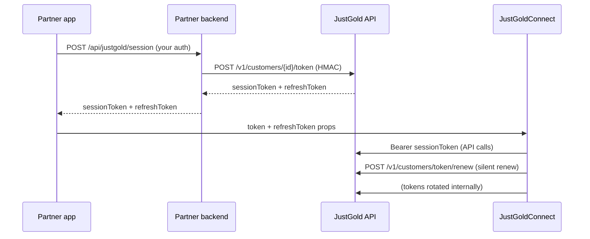

# Session Token

Before rendering the JustGold SDK, your mobile app needs a **short-lived session JWT** and optional **refresh token** from your backend. The app passes these to the SDK — your `client_secret` **never** leaves your server.

> See also: [SDK Overview](sdk/overview.md) · [React Native](sdk/react-native.md) · [Flutter](sdk/flutter.md)

---

## Integration flow



1. **Your backend** signs `POST /v1/customers/{customerIdentifier}/token` with HMAC.
2. **Your app** calls your own session endpoint and receives `sessionToken` + `refreshToken`.
3. **Your app** passes both to `JustGoldConnect` (`token` / `refreshToken` props).
4. **The SDK** renews automatically ~60 seconds before the JWT expires when `refreshToken` is provided.

---

## Issue a session token (partner backend)

### Authentication

Requires HMAC headers:

- `X-Client-Id`
- `X-Timestamp`
- `X-Signature`

See [Authentication](../api/authentication.md) and [Request Signing](../api/request-signing.md).

Use **`@justgold/partner-sdk`** on Node.js 18+ to sign requests:

```ts
import { signRequest } from '@justgold/partner-sdk';

const customerIdentifier = 'your-user-id';
const path = `/v1/customers/${encodeURIComponent(customerIdentifier)}/token`;
const body = JSON.stringify({});

const headers = signRequest({
  method: 'POST',
  path,
  body,
  clientId: process.env.JUSTGOLD_CLIENT_ID!,
  secret: process.env.JUSTGOLD_CLIENT_SECRET!,
});

const res = await fetch(`${process.env.JUSTGOLD_API_BASE_URL}${path}`, {
  method: 'POST',
  headers: { 'Content-Type': 'application/json', ...headers },
  body,
});

const { sessionToken, refreshToken } = await res.json();
// Return both to your mobile app
```

### Endpoint

```http
POST /v1/customers/:customerIdentifier/token
```

| Parameter | Type | Required | Description |
| --- | --- | --- | --- |
| `customerIdentifier` | string | Yes | Partner-scoped customer ID. Created automatically if it does not exist. |

**Request body:** none.

#### Sample request

```http
POST /v1/customers/cust-10293/token
Content-Type: application/json
X-Client-Id: jg_partner_123
X-Timestamp: 1767225600
X-Signature: <hmac_signature>
```

#### Sample response

```json
{
  "sessionToken": "eyJhbGciOiJIUzI1NiIsInR5cCI6IkpXVCJ9...",
  "refreshToken": "g1ZmVyZXNoX3Rva2VuX2V4YW1wbGU..."
}
```

| Field | Type | Description |
| --- | --- | --- |
| `sessionToken` | string | JWT for SDK API calls. Valid for **10 minutes**. |
| `refreshToken` | string | Opaque token for silent session renewal. Valid for **4 hours** (see below). |

#### Responses

| Status | Meaning |
| --- | --- |
| `200 OK` | Token issued successfully |
| `401 Unauthorized` | HMAC signature missing or invalid |
| `429 Too Many Requests` | Rate limit exceeded |
| `500 Internal Server Error` | Unexpected server error |

---

## Renew a session token (SDK automatic)

The SDK calls this endpoint **automatically** ~60 seconds before the JWT expires. Partners normally do **not** call it directly from the app.

### Endpoint

```http
POST /v1/customers/token/renew
```

**Authentication:** none (HMAC not required). The `refreshToken` in the body is the credential.

#### Request body

| Field | Type | Required | Description |
| --- | --- | --- | --- |
| `refreshToken` | string | Yes | Current refresh token |

#### Sample request

```http
POST /v1/customers/token/renew
Content-Type: application/json

{
  "refreshToken": "g1ZmVyZXNoX3Rva2VuX2V4YW1wbGU..."
}
```

#### Sample response

```json
{
  "sessionToken": "eyJhbGciOiJIUzI1NiIsInR5cCI6IkpXVCJ9...",
  "refreshToken": "new_rotated_refresh_token..."
}
```

Each successful renew **rotates** the refresh token — the previous refresh token is invalidated. The SDK manages the new token pair internally.

---

## Revoke a refresh token (optional)

Partners may call this from the backend to explicitly invalidate a refresh token (e.g. user logout). The SDK does **not** call this automatically when the WebView closes.

```http
POST /v1/customers/token/revoke
Content-Type: application/json

{
  "refreshToken": "g1ZmVyZXNoX3Rva2VuX2V4YW1wbGU..."
}
```

**Response:** `204 No Content`

---

## Token lifetime

| Token | Lifetime | Purpose |
| --- | --- | --- |
| `sessionToken` | **10 minutes** | Bearer JWT for authenticated SDK API calls |
| `refreshToken` | **4 hours** (Redis TTL) | Silent renewal before JWT expiry |

### Recommended partner behaviour

| Scenario | Action |
| --- | --- |
| Customer opens JustGold flow | Request a fresh token pair from your backend |
| SDK silent renew succeeds | Tokens rotated internally — no action required |
| Customer leaves SDK / WebView destroyed | Tokens cleared from SDK memory. Request a new pair on next open |
| User logs out of your app | Optionally call `POST /v1/customers/token/revoke` from your backend |

---

## Pass tokens to the SDK

### React Native

```tsx
<JustGoldConnect
  token={sessionToken}
  refreshToken={refreshToken}
  sandbox={false}
  // ...other callbacks
/>
```

Full guide: [React Native integration](sdk/react-native.md)

### Flutter

```dart
JustGoldConnect(
  token: sessionToken,
  refreshToken: refreshToken,
  sandbox: false,
  // ...other callbacks
)
```

Full guide: [Flutter integration](sdk/flutter.md)

---

## Security notes

- **Never** embed `client_id` / `client_secret` in mobile app code.
- Expose a **your-backend-only** session endpoint (e.g. `POST /api/justgold/session`) that returns tokens to authenticated users.
- Match the **`sandbox`** flag on the SDK to the environment your HMAC credentials target:
  - Sandbox API: `https://api.dev.partner.justgold.app`
  - Production API: `https://api.partner.justgold.app`

---

## Related docs

- [SDK Overview](sdk/overview.md)
- [React Native integration](sdk/react-native.md)
- [Flutter integration](sdk/flutter.md)
- [Request Signing](../api/request-signing.md)
- [Customers API](../api/customers.md)
